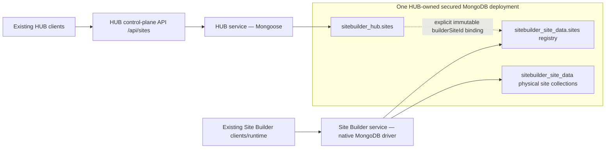

# S2 Mongo consolidation decision

## Verdict

**NO-GO — production evidence unavailable**

Production validation/reconciliation status is exit **30**, not 0 or 10. No persistent S2 implementation, mapping backfill, index apply or production mutation is approved.

## Firm target architecture

The deployment must be a healthy replica set or managed equivalent with authentication, TLS, restricted networking, tested backup/PITR and tested restore. `sitebuilder_hub.sites` and `sitebuilder_site_data.sites` remain separate schemas. HUB remains Mongoose-based; Builder remains native-driver-based. The authoritative identity chain is HUB ObjectId ↔ immutable builderSiteId ↔ Builder registry ↔ safeCollectionName ↔ physical collection. `siteCode`, names and SharePoint paths are never authoritative mapping keys.

HUB `/api/sites` remains the control-plane boundary. A future `/api/site-data/v1` and Gateway remain only architectural placeholders and are explicitly excluded now.

## Production decision inputs

| Input | Result |
| --- | --- |
| Actual Windows evidence | unavailable |
| Evidence validator | production source missing; effective exit 30 |
| Actual Mongo topology/databases | unavailable |
| HUB/Builder/runtime counts | unavailable |
| Explicit mapping distribution | unavailable |
| Integrity/security/backup proof | unavailable |
| Production reconciliation | not run; source unavailable, exit 30 |

The header-only production mapping CSV is not evidence of zero sites; it records that no production rows can be asserted.

## Smallest approved scope

Only evidence-readiness work is approved:

1. transfer the pinned read-only collector/validator through the approved channel;
2. execute it on the actual Windows environment with an approved safe alias and secure output directory;
3. obtain the required manual recovery/proxy attestations;
4. validate and, if allowed, transfer the sanitized evidence bundle;
5. run snapshot reconciliation and human-review the mapping/discrepancies.

Even “identity-binding preparation only” is not approved as persistent S2 scope yet. Depending on evidence, the next smallest scope may be security remediation, target replica-set provisioning, duplicate-disposition tooling, or a reviewed mapping manifest without a model change.

## Gates to reconsider the verdict

- validator exit 0 and no quarantined artifacts;
- reconciliation exit 0, or exit 10 with an owner/disposition for every non-identity, non-integrity warning;
- every site mapped from explicit compatible identifiers or explicitly approved out of scope;
- no ambiguous/duplicate candidate without human disposition;
- no physical/runtime/registry mismatch or integrity blocker;
- topology/auth/TLS/network ownership acceptable for additive work;
- current indexes and both S0/S1 dry-run plans archived;
- verified backup and successful restore evidence;
- reviewed migration manifest, before-image/hash design and disposable apply/rollback proof.

## Explicit exclusions

No persisted `siteDataBinding`, HUB backfill, production unique index, runtime change, Gateway, `/api/site-data/v1`, proxy/browser traffic change, real token, authentication change, repository absorption, data movement, dump/restore, rename, collection merge, physical-name change, dual write, traffic switch, restart, cutover or UI/navigation change is included.

## Verification performed on non-production inputs

- sanitized fixture evidence validator: exit 0;
- missing production evidence and snapshot reconciliation paths: exit 30;
- command-policy scanner: pass;
- snapshot/quarantine/reconciliation regression suite: 17/17 pass;
- full HUB suite: 295/295 pass across 67 files;
- HUB server TypeScript build: pass;
- HUB index migration against local Mongo in dry-run/JSON mode: exit 0, no planned/completed actions;
- Builder index migration against local Mongo in dry-run/JSON mode: exit 0, no planned/completed actions;
- findings JSON Schema instance validation, JSON parsing, 22-column header-only CSV validation and `git diff --check`: pass.

The local dry-runs are S0/S1 regression evidence only; they are not production evidence. The PowerShell collector was not executed because no Windows target or PowerShell runtime was available.
