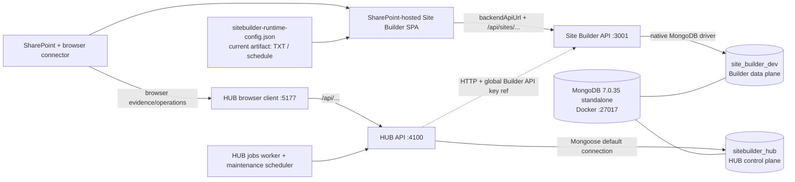
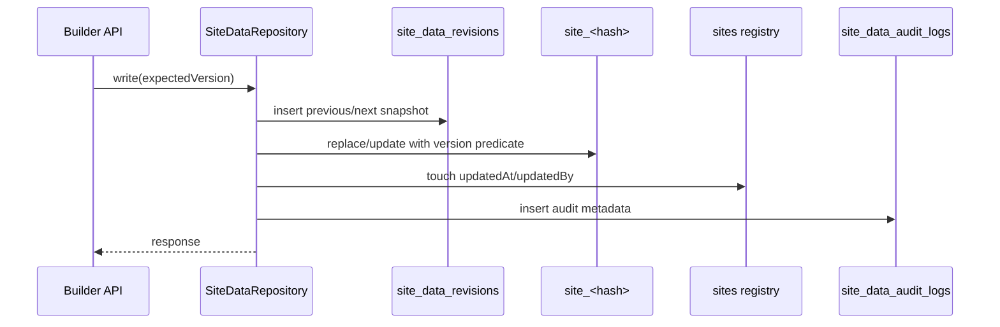
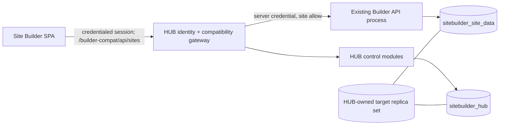
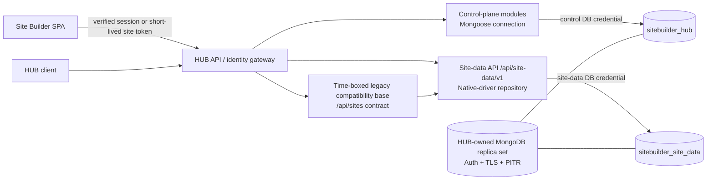
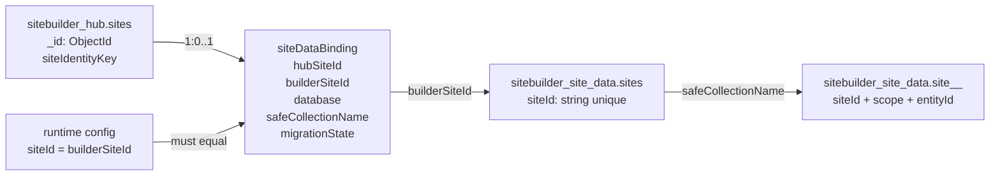

# Audit איחוד MongoDB — Site Builder ו־Site Builder HUB

תאריך הראיות: 2026-07-14 (Asia/Jerusalem)

מצב ביצוע: קריאה בלבד; לא בוצעו migration, seed, restore, שינוי config, הפעלת שרת או cutover.

Inventory מכונה: `docs/sitebuilder-mongo-consolidation-inventory.json`

תוכנית ביצוע ו־rollback: `docs/sitebuilder-mongo-consolidation-roadmap.md`

## פסק דין

המערכות **אינן מוכנות כעת ל־cutover**, אך יש מסלול איחוד בטוח וברור.

בסביבה המקומית שתי האפליקציות כבר משתמשות בפועל באותו תהליך `mongod`, אבל בשני databases לוגיים נפרדים: `sitebuilder_hub` ו־`site_builder_dev`. זה מוכיח ש־deployment משותף עם הפרדת databases עובד ברמת namespace; זה **אינו** מוכיח מוכנות לייצור. ה־deployment החי הוא standalone ללא authentication וללא TLS, מאזין על `bindIp=*`, מפורסם ב־Docker על `0.0.0.0:27017`, ואינו תואם ל־URI של Site Builder שמבקש `replicaSet=rs0`.

היעד המחייב הוא deployment יחיד בבעלות תפעולית של HUB, בתצורת replica set מאובטחת, ובו שני databases:

- `sitebuilder_hub` — control plane של HUB.
- `sitebuilder_site_data` — data plane של Site Builder.

אין לאחד את שתי סכמות `sites` לאותו database ואין להמיר את מסמכי Site Builder למודלי Mongoose. ההפרדה הלוגית היא גבול בעלות, הרשאות, backup ו־rollback; ה־HUB יפעיל שתי connections נפרדות ויחשוף data API בעל namespace מפורש.

## אמינות הראיות וגבולות הבדיקה

מקורות האמת שנבדקו, לפי סדר עדיפות:

1. מצב Mongo החי ב־`127.0.0.1:27017`, בקריאות metadata/aggregate בלבד.
2. הקוד הנוכחי בשני working trees, כולל שינויים מקומיים שטרם נרשמו ב־Git.
3. קובצי environment ו־runtime config, כאשר ערכי סוד לא הועתקו למסמכים.
4. Docker/process/port/volume state מקומי.
5. tests ו־type checks שאינם מתחברים ל־Mongo החי.
6. תיעוד קיים — רק כמקור משני, ובמקום סתירה הקוד והמצב החי גוברים.

לא הייתה גישה לשרת Windows/production מרוחק. לכן IIS/Services/Task Scheduler, topology, databases, reverse proxy ו־runtime artifacts על אותו שרת מסומנים כלא־מאומתים; נספח בסוף מספק חבילת פקודות read-only מדויקת להשלמת הפער.

Baseline של הקוד:

| פרויקט | path | branch / commit | working tree | server / client | Mongo env |
|---|---|---|---|---|---|
| `site-builder` | `/Users/meni/dev/site-builder` | `codex/latest-site-builder-updates` / `a64d2e90f706bc0e3d3dd5818d29516a38a6205b` | שינויים מקומיים רבים קיימים; הבדיקה משקפת את ה־working tree | 3001 בפועל (4000 default בקוד) / 5173 | `MONGODB_URI` + `MONGODB_DB_NAME` |
| `sitebuilder-hub` | `/Users/meni/dev/sitebuilder-hub` | `main` / `5685903b64ccf709fb872522e4e71683b6af9eb7` | לפני ה־audit היה רק קובץ untracked אחד שאינו קשור | 4100 / 5177 | `MONGO_URI` |

Environment matrix, ללא secrets:

| Environment / file | Project | URI target | Database | Replica set | Auth/TLS | Purpose / status |
|---|---|---|---|---|---|---|
| frontend `.env.local` | Builder | API `127.0.0.1:3001` | דרך API | — | dev key בלבד | `mongo`, `local-dev-site` |
| `server/.env.local` | Builder | `127.0.0.1:27017` | `site_builder_dev` גם ב־URI וגם בשם מפורש | `rs0`, `directConnection=true` | credentials לא נמצאו ב־URI; TLS לא | local data API |
| `server/.env.test`/defaults | Builder | local Mongo | `site_builder_test` | local convention | לא מאומת חי | isolated test configuration; tests שנבחרו mocked/in-memory |
| production examples | Builder | configurable | `site_builder` | נדרש לפי runbook | configurable | example בלבד; artifact הנוכחי הוא TXT |
| `.env` | HUB | `127.0.0.1:27017` | `sitebuilder_hub` מתוך ה־URI | לא | ללא credentials/TLS | local control plane, `AUTH_ENABLED=false` |
| `.env.example` | HUB | configurable | מתוך `MONGO_URI` | לא מחייב | configurable | Builder production default עדיין TXT |
| running Docker | HUB-owned container | `0.0.0.0:27017` | שני DBs | standalone | auth/TLS לא מוגדרים | המצב החי היחיד |

## ארכיטקטורה נוכחית — כפי שנמצאה



נקודות חשובות:

- HUB אינו קורא כיום את data plane ישירות. הוא קורא ל־Site Builder API ב־HTTP, עם `X-API-Key` שנפתר בצד השרת מתוך שם משתנה environment.
- ב־`.env` המקומי של HUB לא הוגדרו backend URL או credential reference ל־Site Builder; לכן ה־connector אינו שמיש כרגע.
- ה־dist הנוכחי של Site Builder מוגדר `txt`, עם `siteId=schedule` וללא backend URL. כלומר מסד `site_builder_dev` החי אינו ה־data source של artifact הפריסה המקומי שנמצא.
- אין כרגע שרת Node של Builder או HUB שמאזין. רק container Mongo של HUB פעיל.
- container/volume נפרדים של Builder replica set קיימים כארטיפקטים עצורים. ה־volume הפעיל שייך ל־HUB.

## מצב Mongo החי

### Deployment

| מאפיין | ערך שנמדד | משמעות |
|---|---|---|
| Version / FCV | 7.0.35 / 7.0 | גרסה תקינה, לא אינדיקציה ל־HA |
| Topology | standalone | אין transactions מרובי מסמכים אמינים לצורך התכנון ואין change streams |
| Storage | WiredTiger, persistent | נתונים נשמרים על volume |
| Journal | default, לא הוגדר מפורשות | יש לאמת במדיניות היעד |
| Authentication | לא מוגדר | blocker לייצור |
| TLS | לא מוגדר | blocker לייצור |
| bind/publish | `*` / `0.0.0.0:27017` | חשיפה רחבה מדי |
| Site Builder URI | מבקש `replicaSet=rs0&directConnection=true` | אינו תואם ל־standalone הפעיל |

`w:majority,j:true` מוגדר ב־native driver של Builder, אך ב־standalone “majority” הוא node יחיד ואינו מעניק שרידות של replica set. בנוסף, pipeline הכתיבה של היישום אינו transaction.

### Database של Site Builder

`site_builder_dev`, גודל על דיסק 651,264 bytes:

| collection | מסמכים | תפקיד | max BSON | indexes משמעותיים |
|---|---:|---|---:|---|
| `sites` | 1 | registry של אתרי Builder | 295 B | unique `siteId`, unique `safeCollectionName`, `siteSlug` |
| `site_local_dev_site_6737a6f8b4` | 5 | נתוני אתר פיזיים ו־backup | 56,222 B | `_id`; site/scope/entity/deleted; site/scope/updated; hash |
| `site_data_revisions` | 15 | before/after מלא לכל mutation | 56,025 B | site/document/time |
| `site_data_audit_logs` | 16 | metadata של audit | 649 B | site/document/time |

Reconciliation ל־`local-dev-site`:

- registry ו־physical collection תואמים; אין duplicate `siteId` או `safeCollectionName`.
- אין collection פיזי orphan, document עם `siteId` שגוי, version חסר/לא תקין, `deletedAt` לא תקין, revision orphan או audit orphan.
- אין soft-deleted documents.
- scopes קיימים: `backups`, `config`, `gantt`, `legacyMeta` בלבד.
- חסרים objects צפויים עבור `admins`, `events`, `navigation`, `content`, `design`, `widgets`, `externalLinks`; זהו seed חלקי ולא אתר מלא.
- backup אחד קיים, 56,222 bytes; אין מסמכים מעל 8 MiB או 12 MiB.
- 15 revisions מול 16 audit records. ה־operation הנוסף הוא `admin-backup-create`; בקוד יצירת backup כותבת audit רגיל דרך repository ואז audit אדמיניסטרטיבי נוסף.

### Database של HUB

`sitebuilder_hub`, גודל על דיסק 1,314,816 bytes:

| collection / model | מסמכים | תפקיד | indexes |
|---|---:|---|---:|
| `sites` / `Site` | 4 | control-plane records | 12 |
| `auditlogs` / `AuditLog` | 57 | audit תפעולי | 5 |
| `jobs` / `Job` | 0 | queue/evidence | 8 |
| `monitoringalerts` / `MonitoringAlert` | 0 | alerts | 8 |
| `releases` / `Release` | 7 | release artifacts/metadata | 3 |
| `siteadminsnapshots` / `SiteAdminSnapshot` | 8 | evidence של admins | 4 |
| `sitebackups` / `SiteBackup` | 0 | evidence/operation; לא payload של Builder | 7 |
| `siteversiondeployments` / `SiteVersionDeployment` | 1 | deployment evidence | 6 |

Reconciliation:

- קיימים שני records עם `siteCode=schedule` ושניים עם `siteCode=demo-training`. `siteCode` אינו unique בכוונה; `siteIdentityKey` הוא הגבול הייחודי.
- שני records ישנים חסרים שדות lifecycle/storage חדשים; שני records חדשים יותר מוגדרים `storageBackend=unknown` ו־`lifecycleStatus=draft`.
- לכל ארבעת האתרים חסרים `builderSiteId`, `mongoSiteId`, `safeCollectionName` ו־`backendApiUrl` שימושיים.
- אין HUB record שממופה ל־Builder registry `local-dev-site`; cross-database mapping הוא 0/1.
- אין references יתומים שנמצאו מ־admin snapshots או version deployments ל־Site/Release.
- אין TTL/retention policy ל־audit, revisions או evidence collections.

מיפוי מודלים/planes מדויק:

| Model / repository | collection בפועל | plane | owner | identifier / references | indexes קריטיים |
|---|---|---|---|---|---|
| Builder registry repository | `site_builder_dev.sites` | Site data | Builder | ObjectId פנימי; `siteId` string לוגי | unique `siteId`, unique `safeCollectionName` |
| Builder site repository | `site_builder_dev.site_<slug>_<hash>` | Site data | Builder | deterministic string `_id`; `siteId` | site/scope/entity/deleted, site/scope/time, hash |
| Builder revisions | `site_data_revisions` | Evidence | Builder | ObjectId; `siteId` + `documentKey` | site/document/time |
| Builder audit | `site_data_audit_logs` | Evidence | Builder | ObjectId; `siteId` + `documentKey` | site/document/time |
| `Site` | `sitebuilder_hub.sites` | Control | HUB | ObjectId; `siteIdentityKey` | unique partial identity; status/version/backup/maintenance |
| `Job` | `jobs` | Control + evidence | HUB | ObjectId; optional ref `siteId→Site` | status/time, type, execution/connector modes |
| `Release` | `releases` | Control | HUB | ObjectId | unique version |
| `SiteBackup` | `sitebackups` | Evidence | HUB | ObjectId; refs Site/Job; external `backupId` | unique backupId; site/time |
| `SiteAdminSnapshot` | `siteadminsnapshots` | Evidence | HUB | ObjectId; refs Site/Job | site/captured time |
| `SiteVersionDeployment` | `siteversiondeployments` | Evidence | HUB | ObjectId; refs Site/Release/Job | site/time; individual refs |
| `AuditLog` | `auditlogs` | Evidence | HUB | ObjectId; polymorphic entity string | time; entity/time |
| `MonitoringAlert` | `monitoringalerts` | Control + evidence | HUB | ObjectId; optional site association | unique fingerprint; status/severity/category |

Reconciliation של records חיים (ObjectIds אינם user data; תוכן owner/admin לא נכלל):

| HUB Site ObjectId | siteCode | builderSiteId / mongoSiteId | Builder registry siteId | safeCollectionName | physical exists | status |
|---|---|---|---|---|---|---|
| `6a2a5733af64d40d8f20fe50` | `demo-training` | חסר / חסר | אין mapping | חסר | לא ניתן לקבוע | warning, legacy shape |
| `6a435bfc7936f226860c43a9` | `demo-training` | חסר / חסר | אין mapping | חסר | לא ניתן לקבוע | warning, draft |
| `6a2a5733af64d40d8f20fe4d` | `schedule` | חסר / חסר | אין mapping | חסר | לא ניתן לקבוע | active, legacy shape |
| `6a435bfc7936f226860c43a7` | `schedule` | חסר / חסר | אין mapping | חסר | לא ניתן לקבוע | active, draft |
| — | — | — | `local-dev-site` | `site_local_dev_site_6737a6f8b4` | כן | Builder registry ללא HUB record |

## סכמות, בעלות וזרימות כתיבה

### Site Builder data plane

ה־repository ב־`server/src/repository/SiteDataRepository.js` משתמש ב־native MongoDB driver:

- registry: `_id:ObjectId`, `siteId:string`, `siteSlug`, `safeCollectionName`, display/status/public/schema/timestamps/actors.
- שם physical collection: prefix + slug/siteId מסונן + 10 תווי SHA-256; עד 96 תווים.
- data document: `_id="scope:entityId"`, `siteId`, `scope`, `entityId`, `data`, `schemaVersion`, `version`, `hash`, `deletedAt`, metadata/timestamps/actors.
- backup document: `_id="backup:<backupId>"`, באותו physical collection וב־scope `backups`.
- concurrency: `expectedVersion` חובה. יצירה מצפה 0; version ראשון הוא 1. זהו חוזה טוב ויש לשמרו.
- מחיקה היא soft delete. resurrection נשען על semantics מיוחדים של `expectedVersion=0` ומעלה את version הקודם.

סדר mutation הוא:



אין transaction. לכן כשל או race יכולים להשאיר revision בלי mutation, mutation שהצליח אך API החזיר שגיאה בגלל `touchSite`, או mutation בלי audit. `batch-write`, legacy list import ו־restore הם רצפים best-effort ולא atomic. restore אינו יוצר server-side safety backup אוטומטי.

מיפוי legacy שנשמר דרך `LegacyCompatibilityRepository`:

| קובץ | צורה | scope/identity |
|---|---|---|
| `master_config.txt` | singleton | `config:master` |
| `users_data.txt` | list | `admins` + metadata/manifest |
| `events_data.txt` | list + settings | `events` + metadata/manifest |
| `nav_data.txt` | list | `navigation` + metadata/manifest |
| `site_content.txt` | singleton | `content` |
| `theme_data.txt` | singleton | `design` |
| `widgets_data.txt` | singleton | `widgets` |
| `external_links.txt` | list | `externalLinks` + metadata/manifest |
| `gantt_data.txt` | singleton | `gantt` |

### HUB control plane

HUB משתמש ב־Mongoose connection יחיד הנבחר כולו מתוך database name שמוטמע ב־`MONGO_URI`. ה־`sites` שלו אינו registry של data documents; הוא record עשיר של SharePoint hosting, owner/admin evidence, versions, backups, health ו־mapping ל־Builder.

ב־startup, `server/src/db/mongo.ts` קורא `ensureSiteIndexes()`:

- קורא indexes.
- עלול למחוק legacy unique index בשם `siteCode_1`.
- מבצע backfill ל־`siteIdentityKey` במסמכים.
- יוצר indexes.

לכן הפעלת HUB אינה read-only. בנוסף ה־logger מעביר את `env.MONGO_URI` הגולמי ל־log לאחר החיבור; ברגע שיוזנו credentials זו דליפת סוד פוטנציאלית.

Job claim הוא `findOneAndUpdate` אטומי מ־`queued` ל־`preflight`, אבל:

- אין lease/heartbeat/owner.
- אין recovery ל־`preflight`/`running` אחרי crash.
- `maxAttempts` ו־`nextRetryAt` קיימים בסכמה, אך worker מסמן כשל סופי ואינו אוכף retry policy.
- attempt עולה ב־claim; אין guard של `attempt < maxAttempts`.

לפני איחוד תפעולי יש להוסיף idempotency keys, lease ו־stale-job recovery, במיוחד לפעולות migration/restore.

## APIs ו־runtime contracts

### Site Builder API

כל `/api` מוגן ב־`ADMIN_API_KEY` גלובלי אחד; `/healthz` ו־`/api/healthz` ציבוריים. ה־API כולל registry, CRUD לפי scope/entity, batch read/write, legacy compatibility ו־backups/restores. אין הרשאה לפי `siteId`, role או user.

ה־SPA בונה URLs על ידי הוספת `/api/sites/...` ל־`backendApiUrl`. לכן `backendApiUrl` הנוכחי הוא origin/base **ללא** `/api`. הכנסת URL שכבר מסתיים ב־`/api` יוצרת `/api/api/...`.

runtime config:

- נקרא מ־`sitebuilder-runtime-config.json`, אחר כך `runtime-config.json`, או מ־window global.
- בוחר `storageBackend`, `backendApiUrl`, `siteId` ונתיבי פריסה.
- דוחה credentials מוטמעים ב־URL, query/fragment, ו־HTTP backend מתוך דף HTTPS.
- במכוון אינו מקבל API keys/tokens/credentials.
- production build מאפס `VITE_SITE_BUILDER_API_KEY`, `VITE_SITE_BUILDER_DEV_API_KEY` ו־admin key.

מכאן blocker חוזי: browser production אינו יכול להחזיק global admin key, אך Builder API דורש אותו ואינו קורא cookie/token אחר. בלי reverse proxy חיצוני שלא נמצא ולא אומת, אתר Mongo בפריסה אינו יכול לבצע קריאות production ישירות באופן מאובטח.

### HUB API

HUB מרכיב route roots תחת `/api`, כולל `/api/sites` עבור managed sites. זו התנגשות מלאה בשם עם Builder `/api/sites`, אך עם IDs וסכמות שונים.

HUB מבצע health/create/seed/migrate דרך Builder API:

- health בודק health endpoints, registry, תשעת legacy objects ו־backups.
- create יוצר registry ואחר כך seed של legacy objects, ברצף.
- TXT→Mongo snapshot/write הוא רצפי ומונע activation באותו step.
- HUB שומר `safeCollectionName` שחזר מה־Builder.

HUB אינו ניגש ל־revisions/audit של Builder משום שאין להם API. ה־`SiteBackup` של HUB הוא evidence record; הנתון הניתן לשחזור נשאר ב־Builder backup document. יש להציג ולבדוק אותם כמושגים שונים.

Contract matrix:

| Consumer | base נוכחי | endpoint family | auth נוכחי | target contract |
|---|---|---|---|---|
| Builder SPA | absolute `backendApiUrl` ללא `/api`; מקומי `127.0.0.1:3001` | מוסיף `/api/sites/...` | dev-only `X-API-Key`; production `credentials:include` בלי key | compatibility base ואז `dataApiBaseUrl=/api/site-data/v1` + site token/session |
| HUB browser | `http://localhost:4100/api` default; base כבר כולל `/api` | `/sites`, `/jobs`, `/backups`, וכו׳ | HUB session/personal-number headers; local fallback admin | verified HUB session + roles |
| HUB server | Builder origin ללא `/api` | `/api/sites/...`, health | server-side `X-API-Key` מ־credential ref | internal module; HTTP fallback זמני |
| SharePoint browser connector | SharePoint URLs/paths | browser operations | SharePoint session | נשאר browser-side; evidence בלבד ל־HUB |

Health endpoints אינם זהים: Builder חושף `/healthz` ו־`/api/healthz`; HUB מנהל health/diagnostics תחת ה־API שלו. אין ליצור alias אמביוולנטי; target data health יהיה `/api/site-data/v1/health` ויכלול database/topology status ללא secrets.

### Site Builder flow matrix

| Flow | caller / endpoint | validation/repository | DB/collection/identity | concurrency/failure | rollback נוכחי |
|---|---|---|---|---|---|
| read raw object | adapter → `GET /api/sites/:siteId/data/:scope/:entityId` | route params → `getDocument` | registry resolve → physical `_id=scope:entityId` | no mutation; deleted hidden by default | לא נדרש |
| list scope | service → `GET .../data/:scope` | query paging/filter → `listDocuments` | physical collection by scope | ordering/index dependent | לא נדרש |
| create/update object | adapter → `PUT .../:entityId` | body/data + mandatory expectedVersion → `replaceDocument` | revision + physical + registry + audit | optimistic version; non-transactional partial failure | manual repair/retry conflict בלבד |
| patch object | adapter → `PATCH .../:entityId` | patch + expectedVersion → `patchDocument` | אותם collections | merge ואז replace pipeline | כמו replace |
| soft delete | client → `DELETE .../:entityId` | expectedVersion → `deleteDocument` | revision + `deletedAt` + audit | non-transactional | resurrection דרך write contract |
| restore deleted object | write של אותו entity עם create/resurrection semantics | repository handles deleted record | physical document נשאר עם version history | `expectedVersion=0` special path; version ממשיך | אין endpoint ייעודי |
| create registry | HUB/admin → `POST /api/sites` | normalize/ensure site | `sites`; unique IDs | duplicate races become conflict/error | delete אינו חלק מה־flow |
| create physical collection | first `ensureSite`/write | safe-name algorithm + `initSiteIndexes` | dynamic `site_<slug>_<hash>` | DDL בזמן request/startup; partial index setup possible | cleanup ידני בלבד |
| replace full legacy object | storage adapter → `PUT /legacy-object` | mapping type + expectedVersion → legacy repository | one or many scope docs + `legacyMeta` manifest | singleton/list sequential; partial list possible | previous revisions, no automatic compensation |
| legacy batch | HUB → `POST /legacy/batch-write` | 9 named docs, item validation | all relevant scopes | sequential best-effort, 207 partial | rerun item-by-item |
| create backup | UI/HUB → `POST /backups` | package size ≤8 MiB → repository replace | physical `backup:<id>` + revision/audit | main mutation plus second admin audit | delete backup; no DB snapshot |
| restore backup | UI/HUB → `POST /backups/:id/restore` | package schema/checks → legacy writes | many scope docs/manifests | sequential; partial restore possible | אין safety backup אוטומטי בשרת |
| revision history | internal before every repository mutation | full previous/next snapshot | `site_data_revisions` | inserted before main write | may become orphan evidence on failure |
| audit history | internal after data/touch | metadata + hashes | `site_data_audit_logs` | can be missing after committed mutation; request metadata nesting bug | none |
| TXT/SharePoint migration | migration script/HUB snapshot → legacy batch | dry-run/live flags; per-file mapping | registry + scopes + manifests | sequential, partial failures collected; no transaction | source TXT retained; rerun/manual repair |
| runtime config + auth | browser loads JSON/window, resolves backend/site; API middleware checks key | URL safety and storage descriptor; global key middleware | no direct browser Mongo | production artifact has no key; no site scope | TXT fallback/runtime rollback |

## זהויות והרשאות

| תחום | זהות קנונית נוכחית | בעיה |
|---|---|---|
| HUB managed site | `_id:ObjectId` + `siteIdentityKey` | `siteCode` אינו unique; duplicates קיימים |
| Builder registry | `siteId:string` + unique `safeCollectionName` | אין mapping חי מ־HUB |
| Builder document | collection של האתר + deterministic `_id` | לא ניתן להסיק מ־HUB ObjectId |
| runtime | `siteId` ב־JSON | יכול לסטות מ־`builderSiteId`/`mongoSiteId` |
| UI admin | SharePoint current user/admin lists | אינו קשור קריפטוגרפית ל־Builder API |
| Builder API auth | global API key | הרשאת־יתר לכל האתרים |
| HUB local auth | `AUTH_ENABLED=false` | כל בקשה מקומית מקבלת admin fallback |

כאשר HUB auth מופעל, הקוד מקבל identity headers של SharePoint מהבקשה ומשווה ל־owner/bootstrap/site admins. אין בקוד שכבת אימות עצמאית שה־headers נחתמו על ידי proxy מהימן, ו־site admin יכול לקבל role אדמיניסטרטיבי ברמת HUB. זה blocker אבטחה לפני חשיפת HUB כ־gateway לנתוני אתרים.

Identity target:

- `hubSiteId` נשאר ObjectId פנימי.
- `builderSiteId` הוא string immutable לכל data site.
- mapping קנוני יחיד ב־HUB: `{hubSiteId, builderSiteId, database, safeCollectionName, apiVersion, migrationState}`.
- אין inference מ־`siteCode`, URL או display name.
- fields כפולים (`mongoSiteId`, nested status copies) הופכים read-only projections מה־mapping או מוסרים אחרי backfill מאומת.

## מקור אמת ובעלות נתונים

| Domain | מקור אמת נוכחי | duplication/evidence | מקור אמת ביעד | פעולת migration |
|---|---|---|---|---|
| managed-site identity/hosting | HUB `sites` + SharePoint URL evidence | runtime status ו־nested health | HUB `sites.siteDataBinding` + SharePoint identifiers | reconcile duplicates; לא למזג עם Builder registry |
| Builder storage identity | Builder `sites` | HUB mapping fields/runtime config | Builder registry ב־site-data DB; HUB מחזיק foreign-key-style mapping | copy as-is; backfill mapping |
| content/navigation/events/theme/widgets/external links/Gantt | physical Builder collection או TXT כש־runtime הוא TXT | revisions/audit | Builder site-data DB לאחר site cutover | preserve all 9 legacy contracts; TXT remains source until explicit site migration |
| application admins | `users_data.txt`/Mongo scope `admins` לפי storage backend של האתר | HUB snapshots may copy/compare | Builder data plane | לא לאחד עם HUB roles |
| SharePoint Site Collection Admins | SharePoint live state | HUB `siteadminsnapshots`, Site fields | SharePoint | HUB evidence בלבד |
| SharePoint Owners Group | SharePoint live state | HUB snapshots/Site fields | SharePoint | HUB evidence בלבד |
| HUB users/roles | HUB auth/env policy | Site owner/admin metadata | HUB identity/authorization store | separate from application admins |
| owner metadata | HUB `sites` | SharePoint evidence | HUB control DB | copy control DB; protect as PII |
| Builder application backup | backup document ב־physical site collection | HUB SiteBackup may reference evidence | site-data DB payload | copy; checksum + restore test |
| HUB backup operation | `sitebackups`/jobs/audit | SharePoint/browser evidence | HUB control/evidence DB | preserve; label as evidence, not payload |
| database-level backup | Docker volume/external backup system | none in app | HUB-operated snapshot/PITR | provision and test independently |
| data revisions | `site_data_revisions` | no HUB copy | site-data evidence | copy as-is; add operation correlation |
| data mutation audit | `site_data_audit_logs` | HUB request audit may overlap | separate Builder audit with cross-link | preserve separate collection |
| control audit | HUB `auditlogs` | job/deployment/browser evidence | HUB evidence | preserve; correlate request/operation IDs |
| releases/deployments/jobs/monitoring | HUB collections | Site summary fields | HUB control/evidence DB | copy ObjectIds/references intact |
| runtime configuration | artifact actually served to browser | HUB cached status/preview | signed artifact remains deployment input; HUB mapping validates it | archive old artifact, change base only in its phase |
| SharePoint path evidence | SharePoint + browser capture | HUB Site fields/evidence | SharePoint authoritative; HUB evidence | no conversion to site data |

המשמעות: שני records בשם “site” מייצגים ישויות שונות. HUB `Site` הוא installation/control record; Builder `sites` הוא storage registry. הם נשארים נפרדים ומקושרים, לא ממוזגים.

## Collision matrix

| התנגשות | מצב נוכחי | מה יקרה באותו database | החלטת יעד |
|---|---|---|---|
| `sites` collection | בטוח רק בזכות DB שונה | Mongoose יטען Builder docs כ־HUB docs; Builder יחזיר HUB docs | שני databases, שמות fully-qualified |
| unique `siteId_1` | רק ב־Builder | יצירת index תיכשל על HUB docs רבים ללא `siteId` | לא ליצור ב־control DB |
| unique `safeCollectionName_1` | רק ב־Builder | אותה בעיית missing/null duplicate | לא ליצור ב־control DB |
| HUB `siteCode_1` | non-unique | startup עשוי למחוק/ליצור index על collection מעורב | migrations מפורשות בלבד |
| `/api/sites` | שירותים/Origins שונים | חוזה route אמביוולנטי | `/api/site-data/v1`; compatibility mount נפרד |
| `siteId` | Builder string לעומת HUB refs ObjectId | joins שגויים/עדכונים למסמך הלא נכון | mapping מפורש |
| backups | payload לעומת evidence | false-positive של “יש backup” | שמות/status שונים + restore validation |
| audit | שתי סכמות | כפילות/אובדן correlation | לשמר שתיהן ולחבר `requestId/operationId` |

איחוד פיזי לאותו database הוא תרחיש **אסור**. מעבר כזה יכול גם לגרום ל־`ensureSite()` של Builder לייצר registry נוסף לאחר שהוא קורא HUB record חסר `safeCollectionName`, ול־startup של HUB לבצע backfill על מסמכי Builder.

## סיכונים מדורגים

### P0 — חוסמי cutover

1. deployment Mongo חי ללא replica set, authentication או TLS ועם חשיפה רחבה.
2. חוזה auth של browser מול Builder אינו ישים בצורה בטוחה ב־production.
3. אסור לשים את שתי סכמות `sites` באותו database.
4. אין mapping קנוני בין ארבעת HUB records ל־Builder site החי.
5. מצב Windows/production האמיתי לא נבדק; לא ידוע אם קיימים databases/volumes/services נוספים.

### P1 — נדרש לפני production write cutover

1. writes/revisions/audit, legacy batch ו־restore אינם transactional.
2. HUB auth סומך על headers שאינם מאומתים בתוך השירות; local auth כבוי.
3. startup של HUB ושל Builder מבצע DDL/DML. migrations אינן מופרדות מ־startup.
4. worker ללא lease, recovery, retry enforcement או operation id.
5. HUB connector ל־Builder אינו מוגדר בפועל.
6. backup payload הוא BSON יחיד עם מגבלת app של 8 MiB; restore חלקי אפשרי.
7. אין retention/capacity policy ל־revisions/audit/evidence.
8. MONGO URI גולמי נרשם ב־HUB logs.

### P2 — hardening ותפעול

1. כאשר allowlist של Builder URLs ריקה, HUB מתיר כל URL; זה מגדיל SSRF surface.
2. `requestMeta` של Builder נשמר nested ב־metadata, ולכן top-level `ip`/`userAgent` נשארים ריקים בנתונים שנבדקו.
3. `site_data_audit_logs` אינו נחשף ל־HUB; אין correlation end-to-end.
4. אין quota למספר physical collections או revision growth.
5. duplicate `siteCode` מותר אך דורש UI/operations שלא מניחים ייחודיות.

## סתירות בין תצורה, קוד ומצב חי

| נושא | קוד/config | מצב חי | הכרעה |
|---|---|---|---|
| Builder topology | local URI מבקש `rs0` | standalone של HUB | ה־URI אינו יכול לתאר נכון את השרת הפעיל |
| בעלות Mongo | compose/volumes נפרדים לשני פרויקטים | רק HUB Mongo פעיל ומכיל את שני DBs | מקומית כבר יש co-location מקרי, לא ownership production-ready |
| Site Builder production | runtime/config artifacts הם TXT | קיים DB Mongo חלקי | ה־dist אינו משתמש ב־DB |
| HUB Mongo integration | קוד יודע לקרוא Builder HTTP | env ללא URL/key ref | integration לא פעיל |
| auth | docs/UI מציגים backend/credential ref | runtime artifact אינו כולל credential, כראוי | נדרש gateway/token exchange, לא secret ב־JSON |
| job retries | schema כולל attempts/retry time | worker מסיים ב־failed | אין retry בפועל |

## חלופות ארכיטקטורה

דירוג יחסי: 1 = טוב/נמוך, 5 = גרוע/גבוה. בעמודת security/maintainability, 5 = טוב.

| חלופה | data-loss risk | effort | operational complexity | rollback simplicity | downtime | security | test burden | frontend compatibility | maintainability | החלטה |
|---|---:|---:|---:|---:|---:|---:|---:|---:|---:|---|
| A — deployment אחד, שני DBs, שני services | 2 | 2 | 3 | 5 | 2 | 3 | 2 | 5 | 3 | infrastructure transition |
| B — HUB מארח native repository/data API | 2 אחרי parity; 5 בלי parity | 4 | 2 | 4 עם standby | 2 | 5 | 5 | 4 עם compat | 5 | יעד סופי |
| C — HUB gateway/proxy לשירות Builder | 1 | 3 | 4 | 5 | 1 | 4 אם identity מאומתת | 4 | 5 | 3 | transition contract |
| D — schema rewrite לתוך HUB Mongoose models/database | 5 | 5 | 4 | 1 | 4 | 3 | 5 | 1 | 2 | נדחה |

חלופה נוספת שנבחנה — database יחיד עם collection prefixes — נדחתה: היא מונעת collision רק באמצעות rename/migration רחב ואינה מספקת isolation של roles/backup טוב יותר משני DBs. unified schema נדחה משום ש־HUB Site ו־Builder registry אינם אותה ישות.

המסלול המומלץ הוא A → C → B: תחילה מאחדים deployment בלי לערבב databases; אחר כך מעבירים browser traffic דרך HUB gateway; לבסוף מעבירים את repository/API לתוך HUB מאחורי אותו contract. אין dual-write כללי.

### ארכיטקטורת מעבר



בשלב זה process הישן נשאר, אך browser אינו מקבל global key ושני ה־DBs כבר על deployment אחד.

## ארכיטקטורת יעד מחייבת

מונחים: `mongod` הוא process/node יחיד; replica set הוא קבוצת `mongod` nodes עם replication/election; deployment/cluster הוא יחידת הניהול שאליה clients מתחברים (replica set או sharded cluster); database הוא namespace והרשאות לוגי בתוך deployment; collection הוא namespace למסמכים בתוך database. הדרישה “Mongo אחד” מתממשת ב־deployment אחד, לא ב־database או collection יחידים.



החלטות מפורשות:

- Mongo: replica set של שלושה members או managed equivalent, TLS, authorization, backup/PITR ו־restore drill.
- DB names: `sitebuilder_hub`, `sitebuilder_site_data`.
- collections: משמרים בתחילת הדרך את כל השמות וה־BSON shapes; גם `sites` נשאר בשני DBs. שינוי שמות אינו תנאי לאיחוד ומגדיל סיכון.
- drivers: control plane נשאר Mongoose; data plane נשאר native driver. אין “תרגום” של repository למודל HUB.
- credentials: שני Mongo users/URIs נפרדים. HUB process יכול להחזיק את שניהם דרך secret manager; אין browser Mongo access.
- API: namespace חדש `/api/site-data/v1`. לקוחות ישנים מקבלים compatibility base ייעודי שממשיך לענות ל־`/api/sites` עד שכל artifacts שודרגו.
- auth: identity מאומתת על ידי trusted ingress/HUB; exchange ל־token קצר־חיים עם `siteId`, audience, scopes, subject, expiry ו־request id. אין global admin key ב־browser.
- startup: startup מבצע validation בלבד. כל index/backfill/drop עובר migration command מפורש, מתועד וניתן לחזרה.
- writes: operation id/idempotency key, transaction עבור revision+document+registry+audit כאשר גודל הפעולה מאפשר, ו־fault-injection tests.
- backups: payload ו־evidence נשארים מובחנים; לפני restore נוצרת נקודת שחזור מאומתת. מעבר ל־chunked/GridFS הוא שיפור מאוחר, לא תנאי להעברת DB.

### Site identity mapping ביעד



### Architecture Decision Record — ADR-MONGO-001

**Context:** קיימות שתי אפליקציות עם גבולות נתונים שונים, שתי סכמות בלתי תואמות בשם `sites`, drivers שונים וחוזה browser auth שאינו סגור. במצב המקומי הן כבר חולקות `mongod` אך לא database.

**Decision:** deployment יחיד בבעלות HUB, עם replica set מאובטח ושני databases: `sitebuilder_hub` ו־`sitebuilder_site_data`. Builder registry נשאר `sitebuilder_site_data.sites`; managed-site registry נשאר `sitebuilder_hub.sites`; revisions ואודיט נשארים `site_data_revisions` ו־`site_data_audit_logs`. repository נשאר native-driver based. API target הוא `/api/site-data/v1`; gateway תואם הוא שלב מעבר. הקישור היחיד הוא `siteDataBinding` מפורש.

**Alternatives rejected:** database יחיד עם prefixes מוסיף rename ללא ערך; unified Mongoose schema מערבב ישויות ומגדיל data-loss risk; שני deployments קבועים משאירים ownership, backup ו־security מפוצלים; proxy בלבד אינו יעד סופי.

**Consequences:** HUB מחזיק שתי connections ושני principals; נדרש migration/monitoring לשני DBs; קיימים שני `sites` בשמות fully-qualified; compatibility service נשאר זמנית; transactions נעשים זמינים. היתרון הוא collision isolation, rollback פשוט יותר ושימור BSON/API behavior.

**Migration implications:** תחילה target infrastructure, identity/auth/gateway ו־read parity; אחר כך copy עם write freeze; לבסוף process consolidation. אין schema rewrite או rename במהלך data copy.

**Rollback implications:** לפני target writes חוזרים ל־source. אחרי target writes מבצעים service rollback כשהשירות הישן מחובר ל־target; חזרה ל־source DB דורשת reverse delta מאומת ואינה ברירת המחדל.

### ניסיון להפריך את ההמלצה

- deployment יחיד מגדיל blast radius. התשובה אינה לחזור לשני standalones אלא replica set/managed HA, role isolation, שני pools, resource alerts ו־PITR. שני DBs אינם resource isolation מלא; noisy-neighbor tests נשארים gate.
- HUB process יחיד מגדיל blast radius של release. לכן process consolidation מגיע אחרון, וה־Builder process הישן נשאר standby מחובר ל־target לאורך rollback window.
- mapping נוסף יכול לסטות. לכן יש מקור mapping יחיד, unique partial indexes ו־runtime/registry validation; nested status copies אינם authoritative.
- gateway מוסיף auth/session complexity. למרות זאת הוא נדרש כי browser production אינו יכול לשאת global key. trusted-ingress/cross-site negative tests הם P0 gate.
- write freeze גורם downtime. source standalone והכתיבות הלא־transactional הופכים delta ללא freeze לפחות בטוח; maintenance window קצר עדיף על custom dual-write replicator.
- dynamic collections ו־backup BSON נשארים. שינוי שניהם באותו migration יגדיל סיכון; הם נשמרים עם quotas/alerts ומטופלים ב־follow-up נפרד.

לא נמצא failure scenario שבו database יחיד או schema rewrite מציעים rollback בטוח יותר. ההמלצה נשארת שני DBs על deployment אחד.

## מודל הרשאות Mongo מומלץ

| principal | הרשאה | תחום |
|---|---|---|
| `hub_control_app` | `readWrite` | `sitebuilder_hub` בלבד |
| `hub_site_data_app` | `readWrite` | `sitebuilder_site_data` בלבד |
| `hub_migrator` | read source + `readWrite` target | זמני, מוסר אחרי cutover |
| `hub_backup` | backup/restore roles הנדרשים | automation בלבד |
| `hub_auditor` | `read` | שני DBs, גישה מבוקרת |

ב־HUB יש להשתמש בשתי connection strings נפרדות כדי לשמר least privilege. אין לרשום URI מלא; logs מכילים host alias, database ו־topology בלבד.

## תוכנית migration מסוכמת

| Phase | Objective | mutation | Gate | rollback |
|---|---|---|---|---|
| 0 | להשלים Windows/production evidence ומיפוי זהויות | אין | 100% sites/runtime/source mapping | לא נדרש |
| 1 | להקים target replica set מאובטח | target ריק בלבד | failover + restore drill + role isolation | לפרק target; sources untouched |
| 2 | identity/auth/gateway מול source | config/code בסביבת transition | cross-site negative tests; no secrets | runtime route חזרה לישן |
| 3 | native data API בתוך HUB ב־shadow | אין production writes | full API/fault/idempotency parity | לכבות module |
| 4 | שתי rehearsals של dump/restore/shadow | target rehearsal בלבד | 0 hash/index/API mismatches | למחוק target rehearsal |
| 5 | להעביר HUB control DB | control write freeze | counts/refs/API pass | source לפני writes; app rollback על target אחרי writes |
| 6 | final Builder copy | global Builder write freeze | final manifest zero mismatch | source route לפני target writes |
| 7 | לפתוח target writes ולצפות | target authoritative | SLO/auth/backup/audit gates | old service על target; reverse delta רק אם חוזרים ל־source |
| 8 | decommission | אחרי 14+ ימים | 0 old traffic + restore/sign-off | snapshot retained לפי policy |

### רצף cutover

```mermaid
sequenceDiagram
  participant U as Users
  participant G as HUB Gateway
  participant O as Old Builder API
  participant S as Source Mongo
  participant N as New HUB Data API
  participant T as Target Mongo

  U->>G: traffic through compatibility base
  G->>O: source traffic
  O->>S: reads/writes
  Note over S,T: rehearsal copies + shadow reads; no shadow writes
  G-->>U: maintenance / mutations blocked
  O-->>G: in-flight mutations = 0
  S->>T: final consistent dump/restore
  N->>T: read-only validation
  O->>T: standby compatibility validation
  G->>N: switch route, enable writes
  N->>T: authoritative writes with operation id
  Note over O,T: old process remains standby on target for service rollback
```

ברירת המחדל היא write freeze גלובלי קצר לכל Builder data DB. Cohort migration מחייב source router והעתקה מסוננת של registry, physical collection, revisions ו־audit; הוא מורכב יותר ואינו מוצדק מהנתונים המקומיים שבהם יש Builder site אחד בלבד.

## Data-copy strategy ו־migration manifest

השוואת שיטות:

| שיטה | initial copy | final delta/cutover | indexes/options | החלטה |
|---|---|---|---|---|
| `mongodump/mongorestore` + namespace remap | מתאים לגודל שנמצא ול־rehearsal | מתאים תחת write freeze | נשמרים; חייבים manifest comparison | ברירת מחדל |
| filesystem/storage snapshot | טוב אם platform מספק consistent snapshot | טוב עם freeze/PITR | שומר הכל | עדיף כשהוא managed/tested |
| replica initial sync | דורש topology/ownership משותף | אינו remap בין DB names בקלות | טוב | לא ברירת מחדל |
| application copy | מאפשר site filtering/resume | מגדיל bug surface | דורש יצירה מפורשת | רק אם cohort migration חובה |
| aggregation `$out/$merge` | write-side ומסוכן ל־audit | לא מתאים | indexes לא נשמרים אוטומטית | נדחה |
| dual write | latency נמוכה לכאורה | divergence/retry ordering קשים | לא פותר schema | נדחה |
| change streams | מתאים ל־delta רק ב־replica set | source המקומי standalone | indexes לא חלק מהזרם | אופציונלי רק לאחר הוכחת source topology |

Final copy משמר ObjectIds, string IDs, timestamps, collection options, partial/unique indexes וכל dynamic collections. source standalone מחייב maintenance freeze; אין oplog/change-stream path זמין במצב שנבדק.

כל הרצה מייצרת manifest חתום עם:

```text
migrationId, sourceDeploymentFingerprint, targetDeploymentFingerprint,
sourceDatabase, targetDatabase, startedAt, completedAt,
sourceCodeCommit, hubCodeCommit, operator,
collections[{name, options, sourceCount, targetCount, sourceIndexes,
             targetIndexes, idManifestHash, contentManifestHash,
             maxBsonBytes, checks[]}],
siteMappings[], runtimeConfigCutoverState,
failedChecks[], writeFreezeAt, targetWritesEnabledAt,
rollbackState, sourceSealedAt
```

ה־migrator חייב להיות resumable לפי `migrationId` ו־collection checkpoint. פעולת restore ל־target ריק יכולה לחזור בבטחה; אין upsert עיוור ל־target שקיבל writes.

## Rollback plan

| Layer | מתי | פעולה בטוחה |
|---|---|---|
| 1 — runtime | לפני data cutover | להחזיר compatibility base/route; `siteId` אינו משתנה |
| 2 — API routing | target DB תקין, API חדש נכשל | להפנות ל־old Builder standby שמחובר ל־target |
| 3 — application | HUB release נכשל | rollback release עם אותן target connections |
| 4 — database | target לא קיבל writes | להחזיר source route; RPO=0 |
| 4b — database אחרי writes | mismatch/incident | לחסום writes, לחשב delta מ־operation ledger/revisions/audit, replay ולהשוות; אין flip עד 0 mismatch |
| Disaster recovery | target deployment אבוד | PITR restore ל־replacement, full gates, ואז route |

Triggers: mismatch יחיד ב־count/hash/version/index, mutation אבוד/כפול, cross-site auth יחיד, backup/restore failure, 5xx מעל 1% ל־5 דקות, או p95 מעל 500 ms וגם מעל פי 2 baseline ל־15 דקות. source נשמר immutable לפחות 14 יום או יותר לפי policy. ההחלטה מתקבלת על ידי incident commander, data owner ו־security owner; אם אחד משלושת התחומים integrity/auth/backup נכשל, write traffic נעצר אוטומטית.

## Operations, performance ו־capacity

המצב המקומי זעיר: 57 HUB audit logs, 15 Builder revisions, ארבעה HUB sites ו־Builder site אחד; שני DBs יחד תופסים פחות מ־2 MiB על דיסק לפי `listDatabases`. אין מכאן בסיס להערכת production throughput או concurrency.

חלונות הזמן שנמדדו: HUB audit spans 2026-06-11–2026-07-14; 57 records בתקופה זו. Builder data נוצר ושונה בחלון של פחות משעה ב־2026-07-14, ולכן אינו מאפשר extrapolation של growth. `siteadminsnapshots` כולל 8 records בין 2026-06-30 ל־2026-07-14. יש למדוד production לפחות 14 יום לפני sizing.

המלצות מחייבות:

- להתחיל עם driver pool limits מפורשים ונפרדים ל־control ול־data, ולכוונן לפי concurrent request/job measurements; כרגע הקוד נשען על defaults.
- alerts ל־replica lag, primary election, connections/pool wait, slow queries, disk, working set, oplog window, max BSON, backup age ו־restore age.
- slow-query profiling בצורה מבוקרת וללא payload logs; correlation IDs בכל hop.
- headroom של לפחות 30 יום לפי growth measured, ובחלון migration פי 2 מה־dataset + indexes + backups.
- revisions/audit נשמרים ללא TTL עד compliance decision; אחר כך archive+verify לפני expiry.
- backup document יחיד נשאר זמנית כי max שנמדד 56 KiB, אך threshold alerts ב־6 MiB וחסימה ב־8 MiB נשמרים. אם production מתקרב, להעביר בעתיד ל־GridFS/object storage ב־migration נפרד. database snapshot/PITR נשאר חובה גם אז.
- restore drill רבעוני לפחות, או בתדירות מחמירה יותר לפי RPO/RTO.

## Future code-change map — תמצית מחייבת

| File / area | Change | Why | Risk | Test |
|---|---|---|---|---|
| Builder `server/src/repository/SiteDataRepository.js` | reuse/extract; operation ID + transaction additive | preserve behavior and close partial writes | high | imported repository + fault suite |
| Builder `LegacyCompatibilityRepository.js` | reuse unchanged first; then idempotent manifests | nine-object parity | high | deep old/new parity |
| Builder `backendApiClient.js`, `runtimeConfig.js`, `storageBackend.js` | explicit versioned base + token/session + fallback | remove hidden `/api` and global key gap | high | browser/CORS/auth/runtime tests |
| Builder `siteRoutes.js`/server | compatibility wrapper and standby | rollback surface | medium | route contract suite |
| HUB `config/env.ts`, `db/mongo.ts` | two URIs; redact logs; no startup DDL | isolation/security | high | env/log/startup tests |
| HUB `db/siteIndexes.ts` | explicit migration command | startup must be read-only | medium | dry-run/rollback tests |
| HUB new `db/siteDataMongo.ts`, `siteData/*`, `siteData.routes.ts` | native repository + `/api/site-data/v1` | final process ownership | high | all Builder tests + integration |
| HUB `models/Site.ts` | canonical `siteDataBinding` | stable mapping | high | duplicate/backfill/index tests |
| HUB auth/app middleware | trusted identity and site scope | prevent cross-site/global-admin access | critical | negative security suite |
| HUB Builder health/create/runtime services | internal module with HTTP fallback | staged consolidation | high | old/new evidence parity |
| HUB jobs service/worker | lease, heartbeat, retry policy, operation ID | crash recovery | high | kill/restart/idempotency tests |

רשימת קבצים מלאה וסדר PRs נמצאים ב־roadmap; שום קובץ מקור לא שונה ב־audit זה.

## Future environment-change map — תמצית

| Current | Current owner | Target | Target owner | Transition / removal |
|---|---|---|---|---|
| `MONGO_URI` | HUB | `HUB_CONTROL_MONGODB_URI` + `HUB_CONTROL_DB_NAME` | HUB control runtime | alias לשתי גרסאות ואז הסרה |
| `MONGODB_URI` + `MONGODB_DB_NAME` | Builder server | `HUB_SITE_DATA_MONGODB_URI` + `HUB_SITE_DATA_DB_NAME` | HUB data runtime | נשארים ב־standby; מוסרים ב־decommission |
| `ADMIN_API_KEY` | Builder server | HUB session/site token; temporary server credential ref | HUB identity/gateway | rotate; remove אחרי compatibility |
| `SITE_BUILDER_*BACKEND*` | HUB connector | internal data module flag/compat URL | HUB | HTTP fallback עד final merge |
| runtime `backendApiUrl` | deployed SPA | `dataApiBaseUrl` + `apiVersion`; compat base לישן | artifact managed by HUB | artifact-by-artifact cutover |
| runtime `siteId` | deployed SPA | immutable `builderSiteId` | HUB mapping + Builder registry | נשמר ללא שינוי |
| CORS origins | שני servers | exact SharePoint/HUB origins | HUB gateway | no wildcard; verify per environment |
| worker/backup env | HUB | lease/retry/backup/PITR refs | HUB operations | enabled only after Gate 5/7 |

## Validation gates מחייבים

Cutover אסור אם gate אחד נכשל:

1. topology: שלושה members/managed HA, primary/secondaries בריאים, TLS/auth פעילים.
2. backup: snapshot ו־restore drill מלא לסביבה מבודדת, כולל Builder backup payload.
3. namespace: collections/options/indexes תואמים; אין mixing בין שני `sites`.
4. data: counts, deterministic document-key manifest, hashes, versions, soft deletes, revisions ו־audit תואמים.
5. identity: mapping יחיד לכל אתר; 0 orphan/duplicate mappings; runtime `siteId` תואם.
6. API: parity לכל routes, תשעת legacy objects, optimistic conflicts, batch 207, backup/create/get/delete/restore ו־error shapes.
7. auth: tenant/site isolation; token של אתר A נכשל על B; no-secret scan של dist/runtime/logs.
8. failure: process crash בין revision/document/audit, retry זהה עם operation id, stale job recovery ו־partial restore compensation.
9. performance: p95 אינו גרוע מ־2× baseline ואינו עולה על 500 ms בפעולות CRUD רגילות; error rate מתחת 1% וללא data errors.
10. operations: dashboard/alerts/audit correlation, disk/capacity, replica lag, backup freshness, certificate expiry.

הפרטים וה־rollback matrix נמצאים ב־roadmap.

## Final readiness verdict

| שאלה | תשובה מחייבת |
|---|---|
| deployment Mongo אחד? | כן, בבעלות תפעולית של HUB |
| database אחד או שניים? | שניים: `sitebuilder_hub` ו־`sitebuilder_site_data` |
| למזג את שתי `sites`? | לא; להשאיר registries נפרדים עם mapping מפורש |
| repository driver? | להשאיר native MongoDB driver ל־site data; Mongoose ל־control plane |
| process boundary? | Builder process נשאר זמנית מאחורי HUB gateway; target הוא data API בתוך HUB |
| API namespace? | `/api/site-data/v1`; old `/api/sites` רק ב־compatibility base נפרד |
| mapping identity? | HUB ObjectId ↔ immutable `builderSiteId` ↔ `safeCollectionName` דרך `siteDataBinding` |
| runtime config? | תחילה `backendApiUrl` ל־compat base; אחר כך `dataApiBaseUrl` מפורש; `siteId` נשמר; אין secret |
| auth? | trusted HUB identity + short-lived site-scoped token/session; global key server-to-server זמני בלבד |
| replica set חובה? | כן, לפני production cutover |
| maintenance window? | כן במצב source standalone; write freeze final נדרש |
| sprint ראשון בטוח? | log/startup hardening + read-only mapping/validation tooling; ללא data move |

לכן readiness הוא **NO-GO ליישום production כעת** ו־**GO לתכנון/ספרינט hardening ראשון בלבד**. חמשת החסמים העליונים: Windows production evidence חסר; target Mongo אינו production-grade; browser/API auth אינו סגור; mapping identities חסר; writes/restore/jobs אינם crash-safe/idempotent מספיק.

## בדיקות שבוצעו בפועל

### Code/static

- `git status --short`, branch ו־commit בשני הפרויקטים.
- `rg`/`sed` על configs, routes, repositories, models, services, workers, runtime config, deployment scripts ו־tests.
- secret fingerprint scan ב־Builder dist, HUB client dist ו־HUB server dist: הערך המקומי המוגדר של Builder key לא נמצא.
- `jq empty docs/sitebuilder-mongo-consolidation-inventory.json`: עבר.

### Runtime

- process/listener inspection: לא נמצא Node server של האפליקציות.
- Docker containers/ports/volumes: container הפעיל הוא `sitebuilder-hub-mongo` על 27017; ארטיפקטי Builder replica set עצורים/לא פעילים.
- לא נמצא PM2 או reverse proxy מקומי רלוונטי.

### Mongo read-only

הופעל client עם `retryWrites:false`, `directConnection:true` ופעולות `hello`, `buildInfo`, `getCmdLineOpts`, `getParameter`, `serverStatus`, `listDatabases`, `listCollections`, `collStats`, `listIndexes`, `find` עם projections, `countDocuments`, `distinct` ו־read-only aggregations. לא הופעלו insert/update/delete/createIndex/dropIndex/seed/migration.

### Tests

- Site Builder: 9 test files, 59 tests — עברו.
- HUB: 62 test files, 267 tests — עברו.
- HUB server `tsc --noEmit` — עבר.
- HUB client `tsc --noEmit` — עבר. ניסיון ראשון הצביע בטעות ל־`tsconfig.app.json` שאינו קיים; הפקודה תוקנה ל־`tsconfig.json` ועברה.
- build מלא לא הורץ כדי לא לשנות `dist`/tsbuildinfo בתוך working trees קיימים ומלוכלכים.

### Command log מקובץ

Repository inspection:

```bash
git -C /Users/meni/dev/site-builder branch --show-current
git -C /Users/meni/dev/site-builder rev-parse HEAD
git -C /Users/meni/dev/site-builder status --short
git -C /Users/meni/dev/site-builder log -n 12 --oneline --decorate
git -C /Users/meni/dev/site-builder log -n 20 --oneline --all --grep='mongo\|runtime config\|backend' -i
git -C /Users/meni/dev/site-builder ls-files -o -i --exclude-standard

git -C /Users/meni/dev/sitebuilder-hub branch --show-current
git -C /Users/meni/dev/sitebuilder-hub rev-parse HEAD
git -C /Users/meni/dev/sitebuilder-hub status --short
git -C /Users/meni/dev/sitebuilder-hub log -n 12 --oneline --decorate
git -C /Users/meni/dev/sitebuilder-hub log -n 20 --oneline --all --grep='mongo\|runtime config\|backend' -i
git -C /Users/meni/dev/sitebuilder-hub ls-files -o -i --exclude-standard
rg -n 'MONGO_URI|MONGODB_URI|MongoClient|mongoose\.connect|safeCollectionName|site_data_revisions|site_data_audit_logs|backendApiUrl|API_KEY|withTransaction|startSession|createIndex|dropIndex' /Users/meni/dev/site-builder /Users/meni/dev/sitebuilder-hub
rg --files /Users/meni/dev/site-builder /Users/meni/dev/sitebuilder-hub
```

`sed -n`/`rg -n` שימשו לקריאת הקבצים המפורטים ב־inventory; לא הופעל formatter או generator. ignored runtime inventory הראה בין היתר `.env`, `dist`, `node_modules` ו־runtime artifacts; אלה לא שונו. recent commits מאשרים ש־Mongo backups/runtime config/native local Mongo הם שינויים רלוונטיים ב־Builder, ו־storage-backend/site-identity הם שינויים רלוונטיים ב־HUB.

Runtime inspection:

```bash
ps -axo pid,ppid,command
lsof -nP -iTCP -sTCP:LISTEN
docker ps -a --no-trunc
docker volume ls
docker inspect sitebuilder-hub-mongo
docker port sitebuilder-hub-mongo
pgrep -af 'mongod|mongos|node|vite|tsx|pm2'
```

ה־`docker inspect` נותח מקומית; values רגישים לא הועתקו לדו״ח.

Mongo inspection:

```bash
AUDIT_MONGO_URI='mongodb://127.0.0.1:27017/?directConnection=true' node /tmp/sitebuilder-mongo-audit.mjs
node /tmp/sitebuilder-mongo-audit.mjs | jq '<sanitized inventory projections>'
docker exec sitebuilder-hub-mongo mongosh --quiet --eval '<read-only min/max timestamp aggregation>'
```

Tests/type checks:

```bash
cd /Users/meni/dev/site-builder
npm exec vitest -- run server/src/app.test.js server/src/config/env.test.js server/src/repository/SiteDataRepository.test.js server/src/repository/LegacyCompatibilityRepository.test.js server/src/routes/siteBackups.test.js server/src/migration/sharepointToMongo.test.js src/services/storage/LegacyObjectStorageAdapter.test.js src/services/storage/runtimeConfig.test.mjs scripts/deploymentArtifacts.test.mjs

cd /Users/meni/dev/sitebuilder-hub
npm test -- --run
cd server && npm exec tsc -- -p tsconfig.json --noEmit
cd ../client && npm exec tsc -- -p tsconfig.json --noEmit
jq empty /Users/meni/dev/sitebuilder-hub/docs/sitebuilder-mongo-consolidation-inventory.json
git -C /Users/meni/dev/sitebuilder-hub diff --check -- docs/sitebuilder-mongo-consolidation-audit.md docs/sitebuilder-mongo-consolidation-inventory.json docs/sitebuilder-mongo-consolidation-roadmap.md
```

Builds: לא הורץ build. לא הופעלו health endpoints משום שלא היו servers פעילים והפעלתם הייתה מבצעת index DDL/backfill.

## שאלות פתוחות שחייבות תשובה משרת Windows

1. אילו Mongo services/containers/volumes פעילים ומהם owners ו־backup jobs שלהם?
2. האם production הוא standalone, replica set או managed service?
3. מהם שמות ה־DB וה־collection counts האמיתיים בייצור?
4. אילו IIS bindings/rewrite rules/reverse proxies מפנים ל־3001/4100?
5. אילו runtime config artifacts מוגשים בפועל לכל אתר?
6. האם קיים proxy שמזריק Builder key, ומי מאמת user/site authorization?
7. האם יש jobs תקועים, backup payloads גדולים, soft deletes, orphan mappings או duplicate identities?
8. מהו RPO/RTO המאושר ומהי מדיניות retention/compliance?

## נספח: חבילת פקודות read-only לשרת Windows

יש להריץ ב־PowerShell מורשה, לשמור output באזור מאובטח, ולא לשלוח ערכי secrets. הפקודות אינן משנות שירות, קובץ, registry או database.

### Services, processes, ports ו־tasks

```powershell
$ErrorActionPreference = 'Stop'
Get-Date -Format o
Get-ComputerInfo | Select-Object WindowsProductName,WindowsVersion,OsBuildNumber,CsName
Get-CimInstance Win32_Service |
  Where-Object { $_.Name -match 'mongo|site.?builder|hub|node|iis' -or $_.PathName -match 'mongo|site.?builder|hub|node' } |
  Select-Object Name,State,StartMode,StartName,PathName
Get-Process | Where-Object { $_.ProcessName -match 'mongod|mongos|node|w3wp|nginx' } |
  Select-Object Id,ProcessName,Path,StartTime
Get-NetTCPConnection -State Listen |
  Where-Object { $_.LocalPort -in 27017,27018,3001,4000,4100,5173,5177,80,443 } |
  Select-Object LocalAddress,LocalPort,OwningProcess
Get-ScheduledTask | Where-Object { $_.TaskName -match 'mongo|site.?builder|hub|backup' } |
  Select-Object TaskPath,TaskName,State
```

### Docker ללא הדפסת secrets

```powershell
docker ps -a --format 'table {{.Names}}\t{{.Image}}\t{{.Status}}\t{{.Ports}}'
docker volume ls
$mongoContainers = docker ps -aq --filter 'ancestor=mongo'
foreach ($id in $mongoContainers) {
  docker inspect --format '{{.Name}}|{{json .Config.Cmd}}|{{json .HostConfig.PortBindings}}|{{json .Mounts}}|{{.HostConfig.RestartPolicy.Name}}' $id
  $obj = docker inspect $id | ConvertFrom-Json
  $obj[0].Config.Env | ForEach-Object { ($_ -split '=',2)[0] } | Sort-Object -Unique
}
```

### IIS ו־reverse proxy

```powershell
Import-Module WebAdministration
Get-Website | Select-Object Name,State,PhysicalPath,ApplicationPool
Get-WebBinding | Select-Object protocol,bindingInformation,ItemXPath
Get-WebConfigurationProperty -PSPath 'MACHINE/WEBROOT/APPHOST' -Filter 'system.webServer/proxy' -Name '*'
Get-WebConfiguration -PSPath 'MACHINE/WEBROOT/APPHOST' -Filter 'system.webServer/rewrite/rules/rule' |
  Select-Object name,enabled,patternSyntax,stopProcessing
```

### שמות environment בלבד

```powershell
Get-ChildItem Env: |
  Where-Object { $_.Name -match 'MONGO|SITE_BUILDER|HUB|AUTH|API_KEY|CLIENT_ORIGIN|SERVER_PORT' } |
  Select-Object -ExpandProperty Name | Sort-Object
```

### Runtime artifacts ללא secrets

```powershell
$roots = @('C:\inetpub','C:\apps','D:\apps') | Where-Object { Test-Path $_ }
Get-ChildItem $roots -Recurse -File -ErrorAction SilentlyContinue |
  Where-Object { $_.Name -in 'sitebuilder-runtime-config.json','runtime-config.json','deployment-metadata.json' } |
  ForEach-Object {
    $p = $_.FullName
    try {
      $j = Get-Content -Raw -LiteralPath $p | ConvertFrom-Json
      [pscustomobject]@{
        Path=$p
        StorageBackend=$j.storageBackend
        SiteId=$j.siteId
        BackendOrigin=if ($j.backendApiUrl) { ([uri]$j.backendApiUrl).GetLeftPart([System.UriPartial]::Authority) } else { '' }
        SchemaVersion=$j.schemaVersion
      }
    } catch { [pscustomobject]@{Path=$p;ParseError=$_.Exception.Message} }
  }
```

### Mongo metadata/data integrity בקריאה בלבד

הפקודה מניחה ש־`$env:AUDIT_MONGO_URI` מוזן דרך secret-safe session. היא אינה מדפיסה URI או מסמכים מלאים.

```powershell
mongosh $env:AUDIT_MONGO_URI --quiet --eval @'
const a=db.getSiblingDB('admin');
printjson({hello:a.runCommand({hello:1}),build:a.runCommand({buildInfo:1}).version,fcv:a.runCommand({getParameter:1,featureCompatibilityVersion:1}).featureCompatibilityVersion});
const names=a.adminCommand({listDatabases:1,nameOnly:true}).databases.map(x=>x.name).sort();
for (const n of names) {
  const d=db.getSiblingDB(n);
  const cs=d.getCollectionInfos().map(x=>x.name).sort();
  printjson({database:n,collections:cs});
  for (const c of cs) {
    const coll=d.getCollection(c);
    const s=d.runCommand({collStats:c,scale:1});
    printjson({database:n,collection:c,count:s.count,size:s.size,storageSize:s.storageSize,totalIndexSize:s.totalIndexSize,indexes:coll.getIndexes().map(i=>({name:i.name,key:i.key,unique:!!i.unique,partialFilterExpression:i.partialFilterExpression||null,expireAfterSeconds:i.expireAfterSeconds??null}))});
  }
}
'@
```

Builder reconciliation, לאחר החלפת שם DB בלבד אם נדרש:

```powershell
mongosh $env:AUDIT_MONGO_URI --quiet --eval @'
const d=db.getSiblingDB('site_builder');
const registry=d.sites.find({},{_id:0,siteId:1,safeCollectionName:1,status:1,schemaVersion:1}).toArray();
for (const s of registry) {
  const exists=d.getCollectionInfos({name:s.safeCollectionName}).length===1;
  const c=exists?d.getCollection(s.safeCollectionName):null;
  printjson({siteId:s.siteId,safeCollectionName:s.safeCollectionName,exists,count:exists?c.countDocuments({}):null,wrongSiteId:exists?c.countDocuments({siteId:{$ne:s.siteId}}):null,invalidVersion:exists?c.countDocuments({$or:[{version:{$exists:false}},{version:{$lt:1}}]}):null,scopes:exists?c.distinct('scope').sort():[]});
}
printjson({duplicateSiteIds:d.sites.aggregate([{$group:{_id:'$siteId',n:{$sum:1}}},{$match:{n:{$gt:1}}}]).toArray(),duplicateCollections:d.sites.aggregate([{$group:{_id:'$safeCollectionName',n:{$sum:1}}},{$match:{n:{$gt:1}}}]).toArray()});
'@
```

יש לעצור אחרי איסוף הראיות. אין להריץ `createIndex`, `dropIndex`, `update`, `seed`, `restore`, `mongorestore`, שינוי service או restart כחלק מה־audit.
