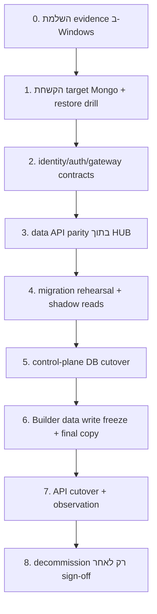

# Roadmap לאיחוד MongoDB תחת HUB

מסמך זה הוא תוכנית בלבד. הוא אינו מאשר ביצוע migration או cutover ואינו כולל שינוי שבוצע בפועל.

## יעד סופי ו־guardrails

היעד הוא deployment יחיד בבעלות HUB:

- replica set של שלושה members או managed equivalent.
- TLS, MongoDB authorization, network allowlist, backup רציף ו־PITR.
- `sitebuilder_hub` ל־control plane.
- `sitebuilder_site_data` ל־data plane.
- Mongoose connection נפרדת ל־control DB ו־native-driver connection נפרדת ל־site-data DB.
- data API תחת `/api/site-data/v1`.
- compatibility base נפרד ללקוחות ישנים שממשיכים לבנות `/api/sites/...`.
- identity מאומתת והרשאה site-scoped; אין Mongo credential או global Builder key ב־browser.

Guardrails שאסור להפר:

1. אין ערבוב של שתי collections בשם `sites` באותו database.
2. אין data migration בזמן startup ואין `dropIndex`/backfill אוטומטי.
3. אין dual-write כללי בין deployments.
4. אין מעבר ל־target לפני count/hash/index/API/auth/restore gates מלאים.
5. אין runtime config עם secret.
6. אין rollback עיוור ל־DB הישן לאחר שהתקבלו writes בחדש.
7. אין מחיקה/שינוי של source deployment במשך חלון rollback.
8. אין הסקת mapping מ־`siteCode`; רק mapping מפורש ומאומת.

## סדר התלות



## Sprint contract matrix

כל sprint מסתיים לפני production mutation; execution של Phases 5–8 דורש change approval נפרד ואינו חלק מה־roadmap implementation עצמו.

| Sprint | Objective | Code areas | DB change | Compatibility | Tests | Migration gate | Rollback gate | Definition of done |
|---|---|---|---|---|---|---|---|---|
| S0 — Evidence | production baseline + mapping | read-only audit tooling/docs | none | none | sanitized-output test | Gate 0 | no mutation | every site/source/runtime mapped |
| S1 — Hardening | remove unsafe startup/log behavior | HUB `mongo.ts`, `siteIndexes.ts`; Builder startup | explicit migration command only in test | runtime unchanged | startup read-only, log redaction | no DDL on startup | old release starts without mutation | logs safe; migrations explicit |
| S2 — Identity | canonical `siteDataBinding` | HUB Site model/service/UI/validators | additive fields/index migration after duplicate report | old fields remain projections | backfill/idempotency/duplicate tests | mapping 100%, 0 duplicates | migration rollback script + old fields intact | one canonical mapping per site |
| S3 — Auth/Gateway | secure browser path | HUB auth/app/gateway; Builder API credential adapter | none | `/builder-compat/api/sites` proxies old service | CORS/CSRF/token/cross-site/no-secret | Gate 2 | route back to old origin | all current reads/writes work via gateway |
| S4 — Data API read parity | native repository in HUB | second connection, `siteData/*`, v1 routes | target test DB only | HTTP fallback and old responses preserved | import Builder tests + shadow hash | Gate 3 read subset | disable feature flag | 0 read parity mismatch |
| S5 — Write safety | transactions/idempotency/worker lease | repositories, operation ledger, jobs worker | additive `site_data_operations` + indexes in test | expectedVersion/error shapes unchanged | fault injection, retry, crash/restart | Gate 3 full | feature flags/off; old service | exactly one committed outcome per operation |
| S6 — Migration tooling | repeatable copy/manifests | CLI/runbooks/diagnostics | rehearsal target only | applications stay on source | two restore rehearsals + compare | Gate 4 | discard target | two zero-mismatch rehearsals |
| S7 — Runtime vNext | explicit API base/version | Builder runtime/client/artifact scripts | none | old `backendApiUrl` fallback | artifact/browser/CORS/auth/no-secret | all artifacts cataloged | restore old runtime artifact | dev/test sites use v1 contract |
| S8 — Cutover package | approved runbooks, dashboards, standby | deploy configs, monitoring, operator tooling | no production action in sprint | old Builder standby image/config ready | game day including rollback levels | Gates 5–7 signed but not executed | abort runbook tested | production change package is reviewable and reversible |

ה־roadmap מסתיים ב־S8. Phases 5–8 להלן מגדירות את change procedure העתידי, אך אינן מורצות בלי אישור production מפורש.

## Phase 0 — השלמת baseline ו־החלטות תפעוליות

### פעולות

- להריץ בשרת Windows את חבילת הפקודות read-only שב־audit.
- לאסוף topology, DB/collection/index counts, services, volumes, IIS/rewrite rules, runtime artifacts ו־backup jobs.
- לזהות את כל אתרי Site Builder הפעילים, storage backend בפועל ו־`siteId` של כל runtime.
- לבנות טבלת mapping ידנית ומאושרת:

| hubSiteId | siteIdentityKey | siteCode | builderSiteId | source DB | safeCollectionName | runtime URL | owner |
|---|---|---|---|---|---|---|---|

- להכריע איזו מבין כפילויות `schedule` ו־`demo-training` היא record קנוני. לא למחוק duplicate; לסמן superseded רק לאחר evidence.
- לאשר RPO/RTO, maintenance window, retention, certificate/secret owners ו־change authority.

### Gate 0

- 100% מה־runtime artifacts ממופים ל־HUB record ול־Builder registry record.
- 0 orphan physical collections או mappings לא מוסברים.
- כל source deployment/volume/backup מזוהה.
- RPO/RTO ו־rollback authority חתומים.

### Rollback

אין mutation בשלב זה; rollback אינו נדרש.

## Phase 1 — הקמת Mongo target בבעלות HUB

### Topology והקשחה

- להקים replica set של שלושה members באזורי כשל נפרדים, או שירות managed עם שקילות מוכחת.
- להפעיל TLS לכל client/server traffic ו־certificate rotation alert.
- להפעיל authorization לפני הכנסת נתונים.
- להגביל network access ל־HUB API, migration runner ו־backup runner בלבד.
- להגדיר write concern target: `w=majority`, `journal=true`, `retryWrites=true`.
- להגדיר monitoring ל־primary availability, replica lag, disk, connections, slow queries, backup freshness ו־certificate expiry.

### Databases ו־principals

| principal | role | database | lifecycle |
|---|---|---|---|
| `hub_control_app` | `readWrite` | `sitebuilder_hub` | קבוע |
| `hub_site_data_app` | `readWrite` | `sitebuilder_site_data` | קבוע |
| `hub_migrator` | read sources + write targets | שני DBs | זמני |
| `hub_backup` | backup/restore minimum required roles | deployment | קבוע ומבודד |
| `hub_auditor` | `read` | שני DBs | לפי צורך |

כל URI נשמר ב־secret manager. logs מציגים רק alias של cluster, database ו־topology; לעולם לא URI מלא.

### Backup ו־restore

- snapshot/PITR לפי RPO המאושר.
- restore drill ל־isolated deployment.
- validation לאחר restore: users/roles, indexes, options, counts, manifests ו־API read parity.
- למדוד restore duration מול RTO.

### Gate 1

- replica failover test עבר.
- TLS/auth/network tests עברו.
- restore drill מלא עבר בתוך RTO.
- credentials של כל app אינם יכולים לקרוא או לכתוב ב־DB האחר.

### Rollback

ה־target עדיין אינו authoritative. מוחקים רק את סביבת ה־target המבודדת אם provisioning נכשל; sources אינם משתנים.

## Phase 2 — חוזי identity, auth ו־gateway לפני העברת DB

יש לפתור את browser contract לפני migration, כדי לא לשנות באותו חלון גם DB, גם endpoint וגם auth.

### Mapping קנוני

להוסיף ל־HUB מבנה יחיד, לדוגמה:

```text
siteDataBinding = {
  builderSiteId: string immutable,
  database: "sitebuilder_site_data",
  safeCollectionName: string,
  apiVersion: "v1",
  migrationState: "source" | "shadow" | "frozen" | "target" | "rollback",
  sourceProfileRef: string,
  lastValidatedAt: date,
  manifestHash: string
}
```

לפני index ייחודי:

1. backfill ב־migration מפורש, לא startup.
2. דו״ח duplicates ו־orphans.
3. review ידני.
4. unique partial indexes על `siteDataBinding.builderSiteId` ועל צירוף database/safeCollectionName.

`mongoSiteId`, `builderSiteId`, `runtimeConfigStatus.builderSiteId` ו־`mongoBackendStatus.siteId` הישנים נשארים זמנית projections/read compatibility; אין לעדכן אותם עצמאית.

### Auth target

- trusted ingress מוחק identity headers שמגיעים מהאינטרנט ומוסיף header חתום, או שה־HUB מאמת token של identity provider/SharePoint.
- session cookie, אם נבחרה, הוא `HttpOnly`, `Secure`, `SameSite=None`, עם exact-origin CORS, CSRF token ו־short expiry.
- ה־HUB מנפיק token קצר־חיים ל־data API עם claims: `sub`, `siteId`, `aud=site-data`, `scopes`, `iat`, `exp`, `jti`.
- middleware אוכף שה־path `:siteId` שווה ל־claim ומבצע role check לכל mutation/backup/restore.
- global Builder key נשאר רק בין HUB gateway לשירות הישן בשלב המעבר ומסובב לפני/אחרי cutover.

### Compatibility gateway

ה־SPA הישן מוסיף `/api/sites`, לכן runtime יכול לעבור ל־base כגון:

```text
https://hub.example/builder-compat
```

וה־HUB יחשוף זמנית:

```text
/builder-compat/api/sites/...
```

ה־gateway מאמת user/site ומזריק את ה־Builder service credential בצד השרת. אין key ב־runtime JSON.

SPA חדש יקבל contract מפורש, לדוגמה `dataApiBaseUrl=https://hub.example/api/site-data/v1`, ולא יוסיף `/api` באופן סמוי.

### Gate 2

- token/session של אתר A נכשל על B בכל read/write/backup/restore route.
- browser dist/runtime/log scan נקי מסודות.
- CSRF, CORS, expiry, key rotation ו־revocation tests עוברים.
- כל אתר עובד דרך gateway מול source DB הישן ללא שינוי נתונים.
- rollback של runtime base ל־Builder origin הישן נבדק בסביבת test בלבד.

### Rollback

להחזיר את runtime base ל־origin הקודם; ה־DB וה־Builder service לא השתנו. אם יש אירוע auth, לבטל sessions/tokens ולסובב את ה־service key.

## Phase 3 — Site-data API בתוך HUB עם parity מלא

### עקרון implementation

אין לכתוב מחדש את data layer ב־Mongoose. יש להעביר/לארוז את ה־native-driver repositories הקיימים עם contracts זהים:

- `SiteDataRepository`
- `LegacyCompatibilityRepository`
- collection-name algorithm
- hashes, versions ו־soft-delete semantics
- backup package format
- legacy route response/error shapes

HUB יפעיל connection שנייה ל־`sitebuilder_site_data`. ה־control models נשארים על connection של `sitebuilder_hub`.

### API namespaces

Target חדש:

```text
GET|POST /api/site-data/v1/sites
GET /api/site-data/v1/sites/:siteId
GET|POST /api/site-data/v1/sites/:siteId/backups
GET|DELETE /api/site-data/v1/sites/:siteId/backups/:backupId
POST /api/site-data/v1/sites/:siteId/backups/:backupId/restore
GET /api/site-data/v1/sites/:siteId/data/:scope
GET|PUT|PATCH|DELETE /api/site-data/v1/sites/:siteId/data/:scope/:entityId
POST /api/site-data/v1/sites/:siteId/data/batch-read
POST /api/site-data/v1/sites/:siteId/data/batch-write
GET|PUT /api/site-data/v1/sites/:siteId/legacy-object
POST /api/site-data/v1/sites/:siteId/legacy/batch-read
POST /api/site-data/v1/sites/:siteId/legacy/batch-write
```

`/api/sites` של HUB נשאר control plane. אין alias של data plane ב־`/api/sites` על אותו base.

### Write safety

לפני production writes:

- להוסיף `X-Request-Id`/`Idempotency-Key` ולשמרם ב־revision/audit.
- להוסיף ledger ייחודי, למשל `site_data_operations` עם unique `{siteId,operationId}`.
- לעטוף revision + document + registry touch + audit ב־transaction כאשר הפעולה מתאימה.
- conflict נבדק בתוך ה־transaction; retry של אותו operation מחזיר אותה תוצאה ולא יוצר revision כפול.
- batch/legacy import מקבל manifest ותוצאת item-by-item זהה לישן. atomic mode יכול להיות additive; default נשאר compatibility עד validation.
- restore יוצר pre-restore backup מאומת, operation manifest ו־compensation plan. אין להבטיח atomicity בלי test של package בגודל מקסימלי.
- fault-injection tests עוצרים אחרי כל שלב ומוכיחים 0 partial state או compensation מתועדת.

### Worker safety

- lease fields: `leaseOwner`, `leaseExpiresAt`, `heartbeatAt`.
- claim predicate כולל `attempt < maxAttempts` ו־lease expired.
- retry classification: transient network/primary errors בלבד; validation/conflict אינם retried אוטומטית.
- exponential backoff עם jitter.
- stale recovery audit.
- operation id קבוע בין retries.

### Gate 3 — contract test matrix

| תחום | בדיקה | תנאי מעבר |
|---|---|---|
| Registry | create/list/get/duplicate | response/status/error זהים |
| CRUD | create/update/patch/delete/resurrect | version/hash/soft delete זהים |
| Concurrency | stale `expectedVersion` ו־race | 409 ללא partial revision/audit |
| Batch | success/partial/invalid | 200/207/error shape זהים |
| Legacy | כל 9 objects, lists/settings/manifests | deep-equal canonical JSON |
| Backup | create/list/get/delete | package/checksum/limits זהים |
| Restore | success/fault after every item | safety backup ו־compensation מאומתים |
| Auth | read/write scopes + cross-site | 0 privilege escapes |
| Idempotency | אותו request 2–10 פעמים | mutation יחיד |
| Restart | crash/restart באמצע job | lease recovery ללא duplicate write |

### Rollback

ה־new API פועל בשלב זה ב־shadow/read-only. traffic ממשיך ל־Builder service הישן. כיבוי route/module החדש אינו משפיע על source.

## Phase 4 — Migration rehearsal ו־shadow validation

### אסטרטגיית העתקה

המסלול הבטוח המומלץ הוא maintenance freeze קצר ב־cutover הסופי, לא dual write. לפני כן מבצעים rehearsal snapshot שאינו authoritative.

1. dump/backup baseline של control DB ושל Builder data DB.
2. restore ל־target names.
3. read-only reconciliation מלא.
4. shadow reads דרך HUB והשוואת hashes/response shapes.
5. מחיקת target rehearsal וחזרה לפחות פעמיים כדי למדוד זמן.

דוגמת פקודות תכנון בלבד; יש להתאים source DB names לאחר Phase 0 ולהריץ רק בחלון מאושר:

```bash
mongodump --uri "$SOURCE_HUB_URI" --db sitebuilder_hub --archive=hub.archive --gzip
mongorestore --uri "$TARGET_CONTROL_URI" --archive=hub.archive --gzip --nsFrom='sitebuilder_hub.*' --nsTo='sitebuilder_hub.*'

mongodump --uri "$SOURCE_BUILDER_URI" --db "$SOURCE_BUILDER_DB" --archive=site-data.archive --gzip
mongorestore --uri "$TARGET_SITE_DATA_URI" --archive=site-data.archive --gzip --nsFrom="$SOURCE_BUILDER_DB.*" --nsTo='sitebuilder_site_data.*'
```

אין להשתמש ב־`--drop` מול DB שאינו target מבודד וריק. יש להצפין archives, להגביל ACL ולמחוק אותם לפי policy. ב־standalone source ה־dump אינו snapshot עקבי בין collections בזמן writes; rehearsal יכול לסבול זאת, final copy לא.

אם source הוא replica set, אפשר להשתמש ב־snapshot/PITR או full-instance dump עם oplog בהתאם ליכולות הכלי. אין להוסיף replicator מותאם רק כדי לחסוך maintenance window אלא אם RTO מחייב והפתרון עבר fault tests.

### Manifest validation

לכל DB לשמור manifest חתום:

- collection name, options, UUID policy ו־index definitions.
- document count, total logical bytes ו־max BSON.
- hash של רשימת `_id` ממוינת.
- ב־Builder physical collections: `_id`, `siteId`, `scope`, `entityId`, `version`, `hash`, `deletedAt`.
- registry mapping: `siteId` ↔ `safeCollectionName` ↔ physical existence.
- revisions: count/hash לפי `siteId/documentKey/previousVersion/nextVersion`.
- audit: count לפי site/operation/day ו־request correlation.
- HUB references: Site/Release/Job/Backup/Snapshot/Deployment integrity.

יש לחשב hash בצד source ו־target עם אותו canonicalization. אין להעתיק PII ל־logs; manifest מכיל hashes ו־counts בלבד.

### Shadow read

- HUB קורא source ו־target, מחזיר רק source response ללקוח.
- comparison אסינכרוני של status, canonical JSON hash, version ו־latency.
- אין shadow writes.
- mismatch יוצר alert עם IDs/hashes בלבד, לא payload.

### Gate 4

- שתי rehearsals רצופות עם 0 count/index/hash/reference mismatches.
- API shadow mismatch = 0 לכל תשעת legacy objects ולכל registry/data/backup reads.
- copy + validation duration נכנס ל־maintenance window.
- capacity ל־14 ימי rollback ול־growth forecast קיימת.

### Rollback

target rehearsal אינו authoritative; למחוק/לבודד אותו ולתקן את התהליך. source לא השתנה.

## Phase 5 — העברת control DB של HUB

מומלץ להפריד את control-plane cutover מחלון Builder data cutover.

### Runbook

1. לעצור scheduler ו־job worker; לאשר שאין `queued`, `preflight`, `running`, `verifying` או browser operation פעיל.
2. לחסום HUB writes ולהשאיר status page.
3. snapshot source control DB.
4. final dump/restore ל־target `sitebuilder_hub`.
5. להריץ manifests/reference/index validation.
6. להפעיל HUB release חדש עם `HUB_CONTROL_MONGODB_URI` בלבד.
7. להפעיל startup validation שאינו כותב.
8. smoke test read-only, אחר כך mutation test על synthetic record בלבד.
9. להפעיל worker/scheduler רק לאחר stale-job audit.

### Gate 5

- 0 active jobs בזמן freeze.
- counts/indexes/references/audit תואמים.
- HUB auth/operations/monitoring/release/sites reads תקינים.
- synthetic create/update/audit/delete cycle תקין ונמחק לפי runbook מאושר.

### Rollback

- לפני target write: להחזיר connection ל־source control DB.
- אחרי target write: rollback של app נשאר על target DB. חזרה ל־source דורשת freeze ו־reverse delta מאומת; אסור flip עיוור.

## Phase 6 — Final Builder data copy תחת write freeze

### למה freeze כולל

ה־repository הנוכחי כותב לא transactionally לשלוש global collections ול־physical collection. source מקומי הוא standalone. final consistency ברמת DB מחייבת עצירת כל Builder writes בזמן snapshot/final copy.

### Runbook מדויק

1. להכריז maintenance ולחסום mutations ב־gateway וב־Builder API; reads יכולים להישאר אם ה־snapshot method מאפשר.
2. לאשר 0 in-flight requests ו־0 mutation jobs.
3. ליצור Builder application backup לכל אתר ולוודא שניתן לקרוא אותו; זה בנוסף ל־database snapshot.
4. לתעד `freezeAt`, source cluster time אם קיים, registry manifest ו־runtime config versions.
5. לבצע final snapshot/dump עקבי.
6. restore ל־`sitebuilder_site_data` תוך שימור BSON, `_id`, indexes, options ו־timestamps.
7. להריץ את כל Gate 4 validations מחדש על ה־final copy.
8. להפעיל את ה־Builder service הישן ב־standby כשהוא מחובר ל־target data DB; הוא מספק rollback של service/API ללא rollback של DB.
9. להפעיל HUB data API ב־read-only מול target ולהשוות responses.
10. רק לאחר sign-off להפעיל writes ב־target ולנתב gateway ל־new API.

אין לשנות schema או naming בזמן copy. `site_builder_dev` הוא שם מקומי בלבד; production source DB name נקבע ב־Phase 0. target תמיד `sitebuilder_site_data`.

### Gate 6 — אפס סובלנות

- collection/options/index manifest תואם.
- counts ו־hashes תואמים.
- כל registry record מצביע ל־physical collection קיים.
- 0 wrong-site docs, invalid versions, invalid `deletedAt`, orphan revisions/audit.
- כל backup מתחת למגבלה, checksum תקין ו־restore test עבר על copy מבודד.
- כל HUB mapping תואם ל־registry ול־runtime config.
- old Builder standby קורא את target בהצלחה.

### Rollback

עד פתיחת writes ב־target: להפנות gateway חזרה ל־source ולסיים maintenance; RPO=0.

## Phase 7 — API cutover, observation ו־rollback levels

### הפעלת traffic

1. synthetic site במשך 24 שעות מול target, כולל writes, conflicts, backup ו־restore sandbox.
2. internal canary users במשך 48 שעות. ה־source DB נשאר write-sealed.
3. פתיחה לכל האתרים לאחר Gate 7.
4. old Builder service נשאר standby מול **target DB**, לא מול source, כדי לאפשר service rollback ללא אובדן writes.
5. source deployment נשמר immutable/read-only לפחות 14 יום או לפי policy ארוך יותר.

אם אין אפשרות עסקית ל־global maintenance window ונדרש cohort per-site, יש לבנות source router ומיגרטור מסונן שמעתיק registry doc, physical collection ו־revisions/audit לפי `siteId`. זה מסלול מורכב יותר ודורש gates נוספים; הוא אינו ברירת המחדל.

### Gate 7

- data mismatch/lost/duplicate writes: 0.
- authorization escape/cross-site access: 0.
- 5xx/timeout rate מתחת 1%; כל data-integrity error מפעיל rollback מיידי.
- p95 CRUD קטן מ־500 ms ולא יותר מפי 2 מה־baseline במשך 15 דקות רצופות.
- replica health/lag בתוך SLO.
- backup freshness ו־restore verification ירוקים.
- audit correlation מלא מ־HUB request דרך operation/revision/audit.

### Rollback matrix

| אירוע | פעולה | DB authoritative | RPO |
|---|---|---|---|
| כשל לפני target writes | route/config חזרה ל־source | source | 0 |
| באג ב־HUB data API, target data תקין | route ל־old Builder standby שמחובר ל־target | target | 0 |
| באג ב־HUB release/control plane | rollback release; להשאיר target connections | target | 0 |
| mismatch אחרי target writes | לחסום writes; לא flip; לחשב delta מ־operation ledger/revisions/audit; לתקן או replay מאומת | target עד החלטה | 0 אם delta מלא |
| target cluster member failure | replica-set failover | target | לפי majority acknowledgement |
| target deployment אבוד | PITR restore ל־replacement; validate לפני route | restored target | לפי RPO מאושר |
| auth/security incident | revoke sessions/tokens/keys, חסימת writes, isolate ingress | target sealed | 0 |

### Triggers אוטומטיים לעצירה/rollback

- count/hash/version/index mismatch יחיד.
- lost או duplicate mutation יחיד.
- cross-site authorization success יחיד.
- backup/restore validation failure.
- אין primary מעבר לסף failover המאושר.
- 5xx מעל 1% במשך 5 דקות.
- p95 מעל 500 ms וגם מעל פי 2 baseline במשך 15 דקות.
- disk forecast מתחת ל־30 ימי headroom.

### כלל זהב לאחר writes

לא מחזירים clients ל־source DB הישן רק משום שהוא זמין. הוא stale מהרגע שה־target קיבל mutation ראשון. rollback בטוח הוא קודם service rollback על target DB; DB rollback דורש freeze ו־reverse delta מוכח.

## Phase 8 — cleanup ו־decommission

רק לאחר 14 ימי observation לפחות, restore drill נוסף ו־business sign-off:

- לבטל compatibility runtime ללקוחות שכבר שודרגו.
- להסיר global Builder key ו־Builder standalone service.
- להסיר `MONGODB_URI`, `MONGODB_DB_NAME`, `ADMIN_API_KEY` של השירות הישן מה־runtime, לא מהיסטוריית audit.
- להסיר temporary migrator role ו־archives.
- להפוך duplicate mapping fields ל־read-only ואז להסירם בגרסה נפרדת.
- להעביר retention policy ל־audit/revisions רק לאחר compliance approval ו־archive test; אין להוסיף TTL עיוור.
- decommission של source deployment רק אחרי snapshot final, restore verification ואישור owner.

## Environment/config migration map

| נוכחי | שלב מעבר | יעד | הסרה |
|---|---|---|---|
| HUB `MONGO_URI` | alias ל־control connection | `HUB_CONTROL_MONGODB_URI` | אחרי שתי גרסאות |
| DB name בתוך HUB URI | explicit validation | `HUB_CONTROL_DB_NAME=sitebuilder_hub` | לא |
| Builder `MONGODB_URI` | נשאר ל־standby service | `HUB_SITE_DATA_MONGODB_URI` ב־HUB | עם decommission |
| Builder `MONGODB_DB_NAME` | target=`sitebuilder_site_data` ב־standby | `HUB_SITE_DATA_DB_NAME=sitebuilder_site_data` | עם decommission |
| Builder `ADMIN_API_KEY` | server-to-server gateway בלבד | short-lived site token/session | אחרי compatibility |
| HUB `SITE_BUILDER_*URLS` | points to old Builder then standby | internal module, no external URL | אחרי final merge |
| HUB `SITE_BUILDER_*API_KEY_REF` | secret ref בלבד | לא נדרש ל־internal module | אחרי final merge |
| runtime `backendApiUrl` | HUB compatibility base | `dataApiBaseUrl` + API version | אחרי שכל artifacts שודרגו |
| runtime `siteId` | ללא שינוי | immutable `builderSiteId` | לא |

נדרשים גם משתנים חדשים או secret refs עבור token issuer/audience/signing keys, trusted ingress, compatibility toggle ו־transaction/idempotency feature flags. שמות סופיים ייקבעו ב־ADR; אין להחזיק signing key ב־client build.

## File-by-file implementation map

### `site-builder`

| קובץ/אזור | שינוי עתידי | תנאי parity |
|---|---|---|
| `server/src/repository/SiteDataRepository.js` | לחלץ ל־site-data core; operation id ו־transaction support additive | כל repository tests + fault injection |
| `server/src/repository/LegacyCompatibilityRepository.js` | לשמר mapping/response; manifest/idempotency | deep parity לכל 9 objects |
| `server/src/routes/siteRoutes.js` | compatibility wrapper בלבד; deprecation headers מאוחרים | status/body/error parity |
| `server/src/auth/apiKey.js` | key נשאר server-to-server זמני; אין browser path | gateway authorization tests |
| `server/src/db/mongo.js` | target DB standby; startup validation בלבד | no startup DDL test |
| `server/src/index.js` | להסיר `initIndexes()` אוטומטי בגרסת transition | explicit migration test |
| `src/services/storage/runtimeConfig.js` | לקבל `dataApiBaseUrl/apiVersion` ללא secrets; fallback לישן | runtime config tests |
| `src/services/storage/storageBackend.js` | להפריד origin מ־API namespace | URL/security tests |
| `src/services/storage/backendApiClient.js` | Authorization/session, request/idempotency IDs, namespace version | browser/API integration tests |
| `src/services/storage/LegacyObjectStorageAdapter.js` | לשמר optimistic version ו־serialization | adapter parity |
| `scripts/deploymentArtifacts.mjs` | לייצר contract חדש ו־compat fallback | no-secret artifact tests |
| `scripts/build-production.mjs` | להמשיך לנקות secrets | dist fingerprint scan |
| `package.json` | להוסיף commands מפורשים ל־compat smoke בלבד; לא לקשור migration ל־build/start | script inspection + no-write dry run |
| `README.md`, Mongo/runtime runbooks | לתעד base/namespace/auth/deprecation ו־rollback | doc command validation |

### `sitebuilder-hub`

| קובץ/אזור | שינוי עתידי | תנאי parity |
|---|---|---|
| `server/src/config/env.ts` | שתי Mongo connections, token/gateway/feature flags | env validation tests |
| `server/src/db/mongo.ts` | control connection בלבד; להסיר raw URI log ו־DDL startup | log redaction + startup read-only test |
| `server/src/db/siteIndexes.ts` | להפוך ל־migration command מפורש | dry-run/duplicate report/rollback |
| `server/src/db/siteDataMongo.ts` (חדש) | native driver connection ל־site-data DB | connection/auth isolation tests |
| `server/src/siteData/*` (חדש) | repositories, transactions, operation ledger | imported Builder contract suite |
| `server/src/routes/siteData.routes.ts` (חדש) | `/api/site-data/v1` | route parity/security tests |
| `server/src/app.ts` | mount namespace ו־compat base ללא התנגשות | `/api/sites` remains HUB-only |
| `server/src/index.ts` | startup/shutdown של שתי connections; graceful drain בלי migrations | restart/in-flight request tests |
| auth middleware | trusted identity + site scopes | cross-site negative suite |
| `server/src/models/Site.ts` | canonical `siteDataBinding` | backfill/index migration gates |
| `server/src/services/builderMongoHealth.service.ts` | internal repository health; HTTP fallback זמני | same health evidence |
| `server/src/services/mongoSiteCreation.service.ts` | internal registry/seed calls; operation id | idempotent create/seed |
| `server/src/services/runtimeConfig.service.ts` | new data API contract + compat preview | artifact parity/no secrets |
| `server/src/services/jobs.service.ts` | lease/retry/idempotency fields | crash/retry tests |
| `server/src/services/jobs.worker.ts` | heartbeat/stale recovery/maxAttempts | worker fault tests |
| backup/restore services | להבדיל payload מ־evidence ולדרוש restore point | full restore drill |
| diagnostics/monitoring | topology, lag, backup, data consistency | alert simulations |
| tests | לייבא את 59 בדיקות Builder הרלוונטיות ולהוסיף integration/fault/auth | 100% gate suite |
| root/server `package.json` + docs/runbooks | commands ל־read-only validation, explicit migration ו־operator docs | dry-run/script-policy tests |

אין לבצע את כל השינויים ב־PR אחד. סדר PRs מומלץ:

1. log redaction + explicit startup migrations.
2. canonical mapping + read-only validation tooling.
3. trusted auth/gateway.
4. second Mongo connection + read-only site-data module.
5. route parity.
6. idempotency/transactions/worker leases.
7. migration tooling/manifests.
8. runtime client contract.
9. cutover configs/runbooks.
10. cleanup/deprecation בנפרד.

## Validation checklist מלאה

### Infrastructure

- [ ] replica set/managed HA בריא ו־failover עבר.
- [ ] TLS/auth/network allowlist פעילים.
- [ ] credentials מופרדים בין DBs.
- [ ] backup/PITR ו־restore drill עברו.
- [ ] disk/lag/cert/backup alerts פעילים.

### Data

- [ ] collection names/options/indexes זהים.
- [ ] `_id` types נשמרו.
- [ ] counts/bytes/max BSON/manifests תואמים.
- [ ] registry ↔ physical collections מלא.
- [ ] versions/hashes/deletedAt תקינים.
- [ ] revisions/audit chains תואמים.
- [ ] HUB references ו־mapping ללא orphans/duplicates.
- [ ] כל תשעת legacy objects קיימים לכל אתר production.

### API/functionality

- [ ] registry CRUD.
- [ ] raw data CRUD + optimistic conflict.
- [ ] batch read/write ו־207 partial semantics.
- [ ] legacy singleton/list/settings/manifest parity.
- [ ] config/users/events/nav/content/theme/widgets/external links/gantt load/save.
- [ ] backup create/list/get/delete.
- [ ] restore כולל pre-restore backup ו־failure recovery.
- [ ] runtime TXT fallback נשמר לאתרים שלא הועברו.

### Security

- [ ] identity headers trusted/signed או token verified.
- [ ] site A אינו קורא/כותב B.
- [ ] viewer/operator/admin scopes נכונים.
- [ ] CSRF/CORS/cookie/token expiry/rotation נבדקו.
- [ ] no secret ב־dist/runtime/logs/audit export.
- [ ] SSRF allowlist אינו ריק בייצור.

### Reliability

- [ ] transaction fault injection בכל boundary.
- [ ] retry עם אותו operation id אינו מכפיל mutation.
- [ ] worker crash/stale lease recovery.
- [ ] restart לא מבצע DDL/DML.
- [ ] source freeze באמת חוסם כל mutation path.
- [ ] old Builder standby קורא וכותב target בסביבת test.

### Operations ו־rollback

- [ ] dashboard מציג cluster/database/site mapping בלי secrets.
- [ ] audit correlation end-to-end.
- [ ] on-call, escalation ו־rollback authority זמינים בחלון.
- [ ] source נשמר immutable 14 יום לפחות.
- [ ] reverse-delta tooling עבר rehearsal, גם אם אינו ברירת מחדל.
- [ ] decommission approval נפרד מ־cutover approval.

## Definition of done

האיחוד נחשב מושלם רק כאשר:

1. שני ה־DBs פועלים על deployment המאובטח בבעלות HUB.
2. כל Site Builder runtime מגיע ל־HUB data API/gateway עם site-scoped authorization.
3. כל הפונקציות הקיימות עברו parity ו־restore tests.
4. source deployment אינו מקבל writes ונשמר לאורך חלון rollback.
5. old Builder service הוסר רק אחרי observation ו־sign-off.
6. אין credentials ב־browser, אין startup mutations ואין unmapped identities.
7. backup/PITR, monitoring, retention ו־on-call נמצאים בבעלות תפעולית מפורשת.
